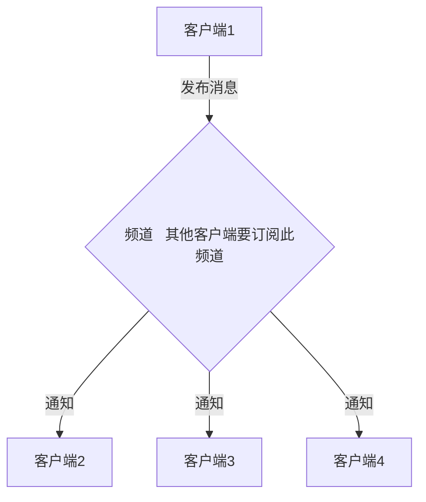

# Redis

### 简介

Redis 是一个完全开源免费的，高性能（==**NOSQL**==）的==**key-value数据库**==(以键值对形式存储)。Redis是一个开源的使用C语言编写、支持网络、可基于内存亦可持久化的日志型、Key-Value数据库，并提供多种语言的APl。

> NOSQL：NOT-ONLY SQL，泛指非关系性数据库。

常用场景：

* 缓存
* 排行榜
* 计数器
* 消息队列

优势：性能高，高速读写

缺点：存储于内存中，占用内存高，持久化问题。

### 安装

1. 获取redis资源

```shell
cd /usr/local/src

wget http://download.redis.io/releases/redis-6.0.1.tar.gz
```

2. 解压：tar xzvf redis-6.0.1.tar.gz -C /usr/local/redis
3. 安装

```java
cd redis-4.0.8

make
```

**可能出现的错误**

make过程可能类似出现`server.C:2404:11:错误：'struct redisServer'没有名为bug_report_ start′的员 server.bug_report start = 0;`的错误，cent7默认的gcc版本过低，使用以下进行升级

```shell
yum -y install centos-release-scl
yum -y install devtoolset-9-gcc devtoolset-9-gcc-c++ devtoolset-9-binutils

scl enable devtoolset-9 bash
```

> 注意：scl命令启用只是临时的，退出xshell或者重启就会恢复到原来的gcc版本。若想保存设置可执行*echo "source /opt/rh/devtoolset-9/enable" >>/etc/profile*


```shell
cd src

make install
```

make成功后使用`make install`可能会出现`Hint: It's a good idea to run 'make test' `，仅是提醒，无需理会。

4.  移动配置文件到安装目录下

```shell
cd ../

mkdir /usr/local/redis/etc

mv redis.conf /usr/local/redis/etc
```

5. redis配置调整：vim redis.conf

   配置redis为后台启动：将daemonize no 改成daemonize yes

   配置远程访问：将protected-mode yes 改为 no

> 关闭protected-mode模式，此时外部网络可以直接访问
>
> 开启protected-mode保护模式，需配置bind ip或者设置访问密码
>
> 设置密码：# requirepass foobared   修改成 : requirepass  123456

6. 将redis加入开机启动：vim /etc/rc.local

   添加命令：`/usr/local/bin/redis-server /usr/local/redis-6.0.1/etc/redis.conf`

7. 启停

   启动服务

```shell
redis-server  前台启动，会占据整个命令行，关闭窗口，服务也会结束
redis-server & (推荐)后台启动
redis-server & /usr/local/redis/etc/redis.conf (根据指定配置文件启动)
```

​	停止redis服务：

​	`kill -9  pid`：强制关闭，pid可通过`ps -ef | grep redis`查询

​	`shutdown`：在客户端进行关闭

​	`redis-cli shutdown`也可以关闭

​	在客户端中命令行中使用`exit`或`quit`可以退出客户端

8.  使用

    启动redis服务端以后，使用redis-cli命令可以进入客户端，即命令行模式，可以在命令行中存取值。

    ```shell
    redis-cli -p 6379;  # 指定端口登录
    redis-cli -h ip地址 -p 端口号; # 远程连接指定ip，指定端口的redis
    ```

9.  卸载redis:

    ```shell
    rm -rf /usr/local/redis-6.0.1 //删除安装目录
    
    rm -rf /usr/bin/redis-* //删除所有redis相关命令脚本
    
    rm -rf /root/download/redis-6.0.1 //删除redis解压文件夹
    ```

>   注意，`make`命令执行后，程序已经可以运行，此时执行命令需要到`redis/src/`目录下去执行命令，执行``make install`命令，类似于windows中的添加到环境变量，将命令复制到了`/usr/local/bin`目录，此时可以任意地方全局执行。

### 配置

redis的默认redis.conf

*   绑定的主机地址，默认只允许本机访问，需要修改 

    **bind 127.0.0.1**

*   指定redis监听端口，默认端口号为6379，作者在自己的一篇博文中解析了为什么选用6379作为默认端口，因为6379在手机按键上MERZ对应的号码，而MERZ取自意大利女歌手Alessia Merz的名字：

    **port 6379**

*   设置检测客户端网络中断时间间隔，单位为秒，如果设置为0，则不检测，建议设置为60：

    **tcp-keepalive 60**

*   日志记录方式，默认为标准输出，如果配置redis为守护进程方式运行，而这里又配置为日志记录方式为标准输出，则日志将会发送给/dev/null：

    **logfile "/usr/local/redis/redis.log"**   

*   指定日志记录级别，redis总共支持四个级别：debug、verbose、notice、warning，默认为verbose,开发阶段debug，项目运行阶段notice或warning：

    **loglevel verbose**

*   密码，默认关闭，若未设置密码，可能无法远程登录。protected-mode=yes时有用，一般不开启

    **requirepass 1234**

*   设置数据库数量，默认值为16，默认当前数据库为0，可以使用select \<dbid>命令在连接上指定数据库id：

    **databases 16**

其他配置

* redis默认(no)不是以守护进程的方式运行，可以通过该配置项修改，使用yes启用守护进程：

  **daemonize** yes

* 当redis以守护进程方式运行时，redis默认会把pid写入/var/run/redis.pid文件，可以通过pidfile指定：

  **pidfile /var/run/redis.pid**

* 设置tcp的backlog，backlog是一个连接队列，backlog队列总和=未完成三次握手队列+已完成三次握手队列。在高并发环境下你需要一个高backlog值来避免慢客户端连接问题。注意Linux内核会将这个值减小到/proc/sys/net/core/somaxconn 的值，所以需要确认增大somaxconn和tcp_max_syn_backlog两个值来达到想要的效果：

  **tcp-backlog 511**

* 当客户端闲置多长时间后关闭连接，如果指定为0，表示永不关闭：

  **timeout 0**

* 指定在多长时间内，有多少次更新操作，就将数据同步到数据文件，可以多个条件配合：

  **save \<seconds> \<changes>**
  **save 300 10：表示300秒内有10个更改就将数据同步到数据文件**

* 指定存储至本地数据库时是否压缩数据，默认为yes，redis采用LZF压缩，如果为了节省CPU时间，可以关闭该选项，但会导致数据库文件变得巨大：

  **rdbcompssion yes**

* 指定本地数据库文件名，默认值为dump.rdb：

  **dbfilename dump.rdb**

* 指定本地数据库存放目录：

  **dir ./**

* 设置当本机为slave服务时，设置master服务的IP地址及端口，在redis启动时，它会自动从master进行数据同步：

  **slaveof \<masterip> \<masterport>**

* 当master服务设置了密码保护时，slave服务连接master的密码：

  **masterauth \<master-password>**

* 设置同一时间最大客户端连接数，默认无限制，redis可以同时打开的客户端连接数为redis进程可以打开的最大文件描述符数，如果设置maxclients 0，表示不作限制。当客 户端连接数到达限制时，redis会关闭新的连接并向客户端返回 max number of clients reached错误消息：

  **maxclients 128**

* 指定redis最大内存限制，redis在启动时会把数据加载到内存中，达到最大内存后，redis会先尝试清除已到期或即将到期的key，当次方法处理后，仍然到达最大内存设置，将无法再进行写入操作，但仍然可以进行读取操作。Redis新的vm机制， 会把key存放内存，value会存放在swap区：

  **maxmemory \<bytes>**

* 设置==**缓存过期策略**==，有6种选择：（==LRU算法：查找最近最少使用的值==）

  *   **volatile-lru**：使用LRU算法移除key，只对设置了过期时间的key；

  *   **allkeys-lru**：使用LRU算法移除key，作用对象所有key(**常用**)；
*   **volatile-random**：在过期集合key中随机移除key，只对设置了过期时间的key;
  
  *   **allkeys-random**：随机移除key，作用对象为所有key；
*   **volarile-ttl**：移除哪些ttl值最小即最近要过期的key；
  *   **noeviction**：永不过期，针对写操作，会返回错误信息。

  **maxmemory-policy noeviction**

* 指定是否在每次更新操作后进行日志记录，redis在默认情况下是异步的把数据写入磁盘，如果不开启，可能会在断电时导致一段时间内数据丢失。因为redis本身同步数据文件是按上面save条件来同步的，所以有的数据会在一段时间内置存在于内存中。默认为no：

  **appendonly no**

* 指定更新日志文件名，默认为appendonly.aof：

  **appendfilename appendonly.aof**

* 指定更新日志条件，共有3个可选值：

  **no：表示等操作系统进行数据缓存同步到磁盘（快）；**

  **always：表示每次更新操作后手动调用fsync()将数据写到磁盘（慢，安全）；**

  **everysec：表示每秒同步一次（折中，默认值）**

  **appendfsync everysec**

* 指定是否启用虚拟内存机制，默认值为no，简单介绍一下，VM机制将数据分页存放，由redis将访问量较小的页即冷数据 swap到磁盘上，访问多的页面由磁盘自动换出到内存中：

  **vm-enabled no**

* 虚拟内存文件路径，默认值为/tmp/redis.swap，不可多个redis实例共享：

  **vm-swap-file /tmp/redis.swap**

* 将所有大于vm-max-memory的数据存入虚拟内存，无论vm-max-memory设置多小，所有索引数据都是内存存储的（redis的索引数据就是keys），也就是说，当vm-max-memory设置为0的时候，其实是所有value都存在于磁盘。默认值为 0：

  **vm-max-memory 0**

* redis swap文件分成了很多的page，一个对象可以保存在多个page上面，但一个page上不能被多个对象共享，vm-page-size是根据存储的数据大小来设定的，作者建议如果储存很多小对象，page大小最好设置为32或者64bytes；如果存储很多大对象，则可以使用更大的page，如果不确定，就使用默认值：

  **vm-page-size 32**

* 设置swap文件中page数量，由于页表（一种表示页面空闲或使用的bitmap）是放在内存中的，在磁盘上每8个pages将消耗1byte的内存：

  **vm-pages 134217728**

* 设置访问swap文件的线程数，最好不要超过机器的核数，如果设置为0，那么所有对swap文件的操作都是串行的，可能会造成长时间的延迟。默认值为4：

  **vm-max-threads 4**

* 设置在客户端应答时，是否把较小的包含并为一个包发送，默认为开启：

  **glueoutputbuf yes**

* 指定在超过一定数量或者最大的元素超过某一临界值时，采用一种特殊的哈希算法：

  **hash-max-zipmap-entries 64**

  **hash-max-zipmap-value 512**

* 指定是否激活重置hash，默认开启：

  **activerehashing yes**

* 指定包含其他配置文件，可以在同一主机上多个redis实例之间使用同一份配置文件，而同时各个实例又拥有自己的特定配置文件：

  **include /path/to/local.conf**

### Redis命令

Redis以key-value的方式存储数据，支持五种数据类型:==string==(字符串)， ==hash==(java中的map)， ==Ilist==(列表，有序)，==set==(集合，无序)及==zset==(sortedset:有序集合)等。

默认有16个数据库，编号0~15，无法像mysql自己创建库，可通过更改配置文件来增减。

##### 常用命令

```properties
select 数据库索引  : 切换数据库 数据库为0-15 (默认一共16个数据库) s设计成多个数据库实际上是为了数据库安全和备份

dbsize : 查看当前数据库的key数量

set key value : 添加指定键值对
get key : 获取键对应的值
keys * : 返回满足的所有键,可以模糊匹配比如keys abc代表abc开头的key，?匹配一个字符，{abc}abc中任一个
exists key : 是否存在指定的key ,存在返回1,不存在返回0
del key : 删除某个key,多个用空格隔开，可删除不存在key，返回删除的个数

expire key seconds : 设置某个key的过期时间时间为秒
ttl key : 查看剩余时间,当key不存在时,返回-2;存在但没有设置剩余生存时间时,返回-1,否则,以秒为单位,返回key的剩余生存时间
persist key:取消过期时间
PEXPIRE key millseconds : 修改key的过期时间为毫秒

flushdb : 清空当前数据库
flushall : 清空所有数据库


move key dbindex : 将当前数据中的key转移到其他数据库
randomkey : 随机返回一个key
rename key newKey : 重命名key
echo : 打印命令

info : 查看redis信息，内存，版本等
config get * : 实时传储收到的请求,返回所有相关的配置，config get port返回端口号

ping : 是否连接成功，连接成功返回PONG
```

##### string

```properties
赋值语法 :
	set key value : 赋值，若已存在，会替换，无视类型
	setnx key value : nx(not exists)，值不存在时设置，返回1，若已存在，不赋值，返回0，可用于分布式锁。
	mset k1 v1 k2 v2 ... : 批量设置
	mget k1 k2 k3 ... : 批量获取
	SETEX key1 10 1x : (expired)设置key1的值为1x ,过期时间为10秒, 10秒后key1清除(key也清除)
	SETRANGE string range value : 替换字符串

取值语法 :
	GET KEY-NAME : Redis GET命令用于获取指定key的值。如果key不存在,返回ni1 。如果key储存的值不是字符串类型,返回一个错误。
	GETRANGE key start end : 用于获取存储在指定key中字符串的子字符串。字符串的截取范围由start和end两个偏移量决定(包括start和end在内)
	GETBIT key offset : 对key所储存的字符串值,获取指定偏移量上的位(bit)
	GETSET语法 : GETSET KEY-NME VALUE Getset命令用于设置指定key的值,并返回key的旧值,当key不存在时,返回nil
	STRLEN key : 返回key所储存的字符串值的长度

删除 :
	del key : 删除指定key对应的键值对(此语法可删除所有类型)

批量写 : MSET k1 v1 k2 v2 ...一次性写入多个值
批量读 : MGET k1 k2 k3

自增/自减:
	INCR KEY-Name :Incr命令将key中储存的数字值增1。如果key不存在,那么key的值会先被初始化为0，然后再执行INCR操作
	INCRBY KEY-Name 增量值  : incrby命令将key中储存的数字加上指定的增量值
	DECR KEY-NAME 或 DECYBY KEY-NAME 减量值:DECR命令将key中储存的数字减1
: (注意这些key对应的必须是数字类型字符串,否则会出错,)
	getrange key startIndex endIndex : 截取字符串，下表从0，两边都是闭区间
	setrange key startIndex value  : 从startIndex开始，将后面的字符串替换为value，只替换value长度位

append key ext : 在key的值后面追加ext，不存在key则直接设置值
```

应用：

 * string通常用于保存单个字符串或SON字符串数据
 * 因String是二进制安全的,所以你完全可以把一个图片文件的内容作为字符串来存储
 * 计数器(常规key-value缓存应用。常规计数:微博数,粉丝数)

> INCR等指令本身就具有原子操作的特性,所以我们完全可以利用redis的INCR、INCRBY, DECR, DECRBY等
> 指令来实现原子计数的效果。假如,在某种场景下有3个客户端同时读取了mynum的值(值为2) ,然后对其
> 同时进行了加1的操作,那么,最后mynum的值一定是5。不少网站都利用redis的这个特性来实现业务上的统计计数需求。

##### hash

类似于java中的map

```properties
赋值语法 :
	HSET KEY FIELD VALUE : 为指定的KEY,设定FILD/VALUE
	HMSET KEY FIELD VALUE [FIELD1, VALUE1] : 同时将多个field-value (域-值)对设置到哈希表key中

取值语法 :
	HGET KEY FIELD : 获取存储在HASH的值,根据FIELD得到VALUE
	HMGET KEY field [field1] : 获取key所有给定字段的值
	HGETALL KEY : 返回HASH表中所有的字段和值

	HKEYS KEY : 获取所有哈希表中的字段
	HLEN KEY : 获取哈希表中字段的数量

删除语法:
HDEL KEY field1 [field2] : 删除一个或多个HASH表字段

其它语法 :
	HSETNX key field value : 只有在字段field不存在时,设置哈希表字段的值
	HINCRBY key field increment : 为哈希表key中的指定字段的整数值加上增量increment
	HINCRBYFLOAT key field increment : 为哈希表key中的指定宇段的浮点数值加上增量increment 。
	HEXISTS key field : 查看哈希表key中,指定的字段是否存在
```

应用场景：

* 常用于存储一个对象

* 为什么不用string存储一个对象?

  > ​		hash是最接近关系数据库结构的数据类型,可以将数据库一条记录或程序中一个对象转换成hashmap存放在redis中。用户ID为查找的key,存储的value用户对象包含姓名,年龄,生日等信息,如果用普通的key/value结构来存储,主要有以下2种存储方式:
  > ​		第一种方式将用户ID作为查找key,把其他信息封装成一个对象以序列化的方式存储,这种方式的缺点是,增加了序列化/反序列化的开销,并且在需要修改其中一项信息时,需要把整个对象取回,并且修改操作需要对并发进行保护,引入CAS等复杂问题。
  > ​		第二种方法是这个用户信息对象有多少成员就存成多少个key-value对儿,用用户ID+对应属性的名称作为唯一标识来取得对应属性的值,虽然省去了序列化开销和并发问题,但是用户ID为重复存储,如果存在大量这样的数据,内存浪费还是非常可观的。

##### list

```properties
lpush key v1 v2 v3 : 依次放置，最前面的值在最右侧，添加到最前
lrange key [startIndex endIndex]  : 获取列表中指定列表指定区间元素
rpush key v1 v2 v3 : 依次放置，按照排列顺序，添加到最后

lpop key : 移除并返回最左侧元素
lindex key [startIndex endIndex] : 获取列表中指定列表指定区间元素
llen key : 指定列表长度

1rem key count value : count>0,从左开始，移除指定的value值，移除count个,count<0从右开始
```

##### set

无序，不可重复

```properties
sadd key value [value value ...] : 将一个或者多个元素添加到指定的集合中,已存在忽略
smembers key : 获取指定集合中所有的元素

sismember key value : 判断指定元素value在集合中是否存在
scard key : 元素个数
srem key value [value value ...] : 移除元素，不存在忽略，返回移除个数
srandmember key [count] : 随机获取一(n)个元素,count>0,不能重复，count<0,可重复
spop key [count] : 从指定集合中随机移除一个或者多个元素
smove source dest member : 将指定集合中的指定元素移动到另一个元素

sdiff key k1 [k2 k3 ...] : 返回只有key中包含，而k1 k2等不包含的元素
sinter k1 k2 [k3 ...]  : 求交集
sunion k1 k2 [k3 ...] : 并集
```

##### zset

排序集合，不可重复，每个数据都必须关联一个分数，用于排序

```properties
zadd key score member [score1 member1 ...] : 将一个或者多个member及其score值加入有序集合,会覆盖
zrange key startIndex endIndex [withscores] : 获取指定有序集合中指定下标区间的元素(显示分数)
zrangebyscore key min max [withscores]: 获取指定有序集合中指定分数区间的元素
zrem key member [member1 ...] :删除指定有序集合中一个或者多个元素
zcard key : 元素个数
zrank key member : 获取指定有序集合中指定元素的排名从小到大，zrevrank从大到小
zcount key min max : 获取指定有序集合中分数在指定区间内的元素的个数
zscore key member : 获取指定有序集合中i定元素的分数
```

### 持久化

##### RDB

RDB（Redis DataBase)是Redis默认的持久化方案，默认开启。在指定的时间间隔内，执行指定次数的写操作，则会将内存中的数据写入到磁盘中。即在指定目录下生成一个dump.rdb文件。Redis重启会通过加载dump.rdb文件来恢复数据。

默认1分钟内改变了1万次

或者5分钟内改变了10次

或者15分钟内改变了1次

**save seconds changes**

配置文件中搜`save`配置，即可找到

**stop-writes-on-bgsave-error** : 当bgsave 快照操作出错时停正写数据到磁盘，这样能保证内存数据和磁盘数据的
一致性，但如果不在乎这种一致性，要在bgsave快照操作出错时继续写操作，这里需要配置为no。

**rdbcompression** ：设置对于存储到磁盘中的快照是否进行压缩.设置为yes时：dis 会采用LZF算法进行压缩；如果不想消耗CPU进行压缩的话，可以设置为no，关闭此功能。

**rdbchecksum** ：在存储快照以后，还可以让Redis 使用CRC64算法来进行数据校验，但这样会消耗一定的性能，如果系统比较在意性能的提升，可以设置为no，关闭此功能。

**dbfilename** : Redic持久化数据生成的文件名，默认是dump.db，也可以自己配置。

**dir:Redis**  : 持久化数据生成文件保存的目录，默认./即redis的启动目录，也可以自己配置。

##### AOF

RDB触发策略存在缺陷，可能有些数据未达到触发要求，无法持久化到磁盘上，AOF采用操作日志来记录进行每一次写操作，类似mysql的主从复制策略，每次启动会执行一次。redis做缓存数据，不注重安全性，一般不用开启

**appendonly**:配置是否开启AOF，yes表示开启，no表示关闭。默认是no。

**appendfilename**: AOF 保存文件名

**appendfsync**:AOF异步持久化策略

​	always:同步持久化，每次发生数据变化会立刻写入到磁盘中。性能较差但数据完整性比较好（慢，安全）

​	everysec:出厂默认推荐，每秒异步记录一次（默认值）

​	no:不即时同步，由操作系统决定何时同步。

**no-appendfsync-on-rewrite** : 重写时是否可以运用appendsync，默认no，可以保证数据的安全性。

**auto-aof-rewrite-percentage** : 设置重写的基准百分比

**auto-aof-rewrite-min-size** : 设置重写的基准值

### 事务

redis的事务不能保证全部原子性，只能保证部分原子性，如果在压入事务队列的过程中中发生错误，此时可以保证原子性，如果压入事务队列过程中没有出错，执行过程出错，此时已经执行的数据不会回滚，如对字符串进行加减操作。

```properties
multi : 开启事务，之后的命令会被压入队列
exec : 执行事务
discard : 取消事务
```

多线程同时操作同一数据，可能出现问题，如账户共1000，两个线程同时取款，账户金额会出现问题，可以通过乐观锁加version的方式进行避免。

redis提供了`watch`命令来实现上述效果

```shell
set money 100
watch money

multi
decr money 50
...
exec

unwatch # 放弃监控某个key
```

此时**watch**可以观察money在事务执行过程中有没有被更改

### 订阅与发布

消息通信，一般不用，有消息中间件可以用



```properties
subscribe c1 [c2 c3 ...] : 订阅一个或者多个频道的消息。

publish c1 hello:将消息hello发布到指定频道c1

psubcribe : 支持通配符的订阅
```

### 主从复制

三台redis服务器使用不同的配置文件名，pid、dbfilename，port、logfilename，一般加上端口号作为文件名，偏于区分。

**info replication** 查看主从角色

##### 建立集群

默认都是主机，更改从机即可

**slaveof 127.0.0.1 6379** 使当前机器成为指定ip指定端口主机的从机，重启失效

可修改配置文件中`replicaof <masterip><masterport>`进行配置


全量复制：一旦主从关系确定，会把主机上全部数据复制到从机上，重新连接后会自动全量复制

增量复制：主机的写入数据会自动复制到从机上

##### 宕机

主机宕机，从机只能读取数据，无法写入数据，主机恢复后自动复原

从机宕机，主机少了一个从机，从机恢复后连接

当主机宕机后，使用**`slaveof no one`**命令，可以将从机变成主机，然后将其他从机从属于该主机

##### 哨兵模式

主机宕机后自动选择主机，从机宕机后自动连接，主机宕机恢复后自动变为从机。

在redis安装目下创建配置文件：redis_sentinel.conf(可任意名字)

```shell
sentinel monitor 任意名字 主机ip 主机端口 需要的投票数
```

主机宕机后，根据设置的票数，先得到指定票数者称为新的主机

启动哨兵线程,与启动服务器一致，命令已经被放到`/usr/local/bin`目录下

```shell
redis-sentinel 哨兵配置文件的位置;
redis-sentinel redis sentinel.conf
```

一般还会配置多哨兵，以防哨兵宕机，可以在哨兵的配置文件进行配置端口，开启多个哨兵，还有转移时间等可以进行配置。

### 缓存穿透与雪崩

### ==**TODO**==

### 项目整合

可以使用jedis来操作redis，springboot也整合了spring-boot-starter-data-redis

##### 依赖

```xml
<!--redis -->
<dependency>
    <groupId>org.springframework.boot</groupId>
    <artifactId>spring-boot-starter-data-redis</artifactId>
</dependency>

<!-- spring2.X集成redis所需ccmmon-pool2 -->
<dependency>
    <groupId>org.apache.commons</groupId>
    <artifactId>commons-pool2</artifactId>
    <version>2.6.0</version>
</dependency>
```

##### 配置类

```java
@EnableCaching
@Configuration
public class RedisConfig extends CachingConfigurerSupport {
    @Bean
    public RedisTemplate<String,Object> redisTemplate(RedisConnectionFactory factory) {
        RedisTemplate<String,Object>template =new RedisTemplate<>()；
            RedisSerializer<String> redisSerializer = new StringRedisSerializer()；
            Jackson2JsonRedisSerializer jackson2]sonRedisSerializer = new
            Jackson2JsonRedisSerializer(Object.class)；
            ObjectMapper om = new ObjectMapper();
        om.setVisibility(PropertyAccessor.ALL,JsonAutoDetect.Visibility.AMY)；
            om.enableDefaultTyping(ObjectMapper.DefaultTyping.NON_FINAL);
        jackson2JsonRedisSerializer.setObjectMapper(om)；
            template.setConnectionFactory(factory)；
            // key序列化方式
            template.setKeySerializer(redisSerializer)；
            // value序列化
            template.setValueSerializer(jackson2JsonRedisSerializer)；
            // value hashmap序列化
            template.setHashValueSerializer(jackson2JsonRedisSerializer);
        return template;
    }

    @Bean
    public Cachelanager cacheManager(RedisConnectionFactory factory){
        RedisSerializer<String) redisSerializer = new StringRedisSerializer()；
            Jackson2JsonRedisSerializer jackson2JsonRedisSerializer = new
            Jackson2JsonRedisSerializer(Object.class);I
            //解决查询缓存转换异常的问题
            ObjectMapper om = new ObjectMapper()；
            om.setVisibility(PropertyAccessor.ALL,JsonAutoDetect.Visibility.ANY)；
            om.enableDefaultTyping(ObjectMapper.DefaultTyping.NON_FINAL);
        jackson2JsonRedisSerializer.setObjectMapper(om);
        //配置序列化（解决乱码的问题），过期时间609秒
        RedisCacheConfiguration config =RedisCacheConfiguration.defaultCacheConfig()
            .entryTtl(Dura tion.ofSeconds(600))
            .serializeKeyswith(RedisSerializationContext.SerializationPair.fromSerializer(redisSerializer))
            .serializeValueswith(RedisSerializationContext.SerializationPair.fromSerializer(jackson2]sonRedisSerializer))
            .disableCachingNullValues()；
            RedisCacheManager cacheManager =RedisCacheManager.builder(factory)
            .cacheDefaults(config)
            build()；

            return cacheManager;
    }
```

##### 注解

>   @Cacheable

常用于查询方法上，若游缓存，将缓存中的结果返回，若没有此缓存，查询数据库，并将结果放入缓存中。


| 属性/方法名 | 解释                                             |
| ----------- | ------------------------------------------------ |
| value       | 缓存名的别名 |
| cacheNames  | 缓存名，它指定了你的缓存存放在哪块命名空间       |
| key         | 可选属性，可以使用SpEL标签自定义缓存的key        |

@Cacheable(value="user" key="'findAllUser'")

此时存入redis的为`user::findAllUser`

>   @CachePut

使用该注解标志的方法，每次都会执行，并将结果存入指定的缓存中。其他方法可以直接从响应的缓存中读取缓存数据，而不需要再去查询数据库。一般用在新增方法上。

属性值与@Cacheable一样。

>   @CacheEvict

使用该注解标志的方法，会清空指定的缓存。一般用在更新或者删除方法上。

| 属性/方法        | 解释                                                         |
| ---------------- | ------------------------------------------------------------ |
| value            | 缓存名别名                                                   |
| cacheNames       | 缓存名，它指定了你的缓存存放在哪块命名空间                   |
| key              | 可选属性，可以使用SpEL标签自定义缓存的key                    |
| allErntries      | 是否清空所有缓存，默认为false。如果指定为true，则方法调allErntries用后将立即清空所有的缓存 |
| beforeInvocation | 是否在方法执行前就清空，默认为false。如果指定为true，则在方法执行前就会清空缓存 |

##### 配置yaml

```yaml
spring: 
	redis:
		host: 192.168.44.132
		port: 6379
		database: 0
		timeout: 1800000
		lettuce:
			pool:
				max-active: 20
				# 最大阻塞等待时间（负数表示没限)
				max-wait: -1
				max-idle: 5
				min-idle: 0
```

### CAP理论

分布式系统

-   Consistency：一致性
-   Availability：可用性
-   Partition tolerance：分区容错性

分区容错性：某个节点或者网络分区出现了故障的时候，整个系统仍然能对外提供满足一致性和可用性的服务。也就是说部分故障不影响整体使用。

一致性：对一个分区的文件做了修改，所有分区在同一时间的数据一致。

可用性：用户访问数据时，系统是否能在正常响应时间返回结果。也就是在极端环境下，可能会丢弃一些请求，消费者程序需要重新请求才能获得结果

根据cap理论，只能同时满足其中的两个(CP,AP,CP)，而无法同时满足CAP，而对于分布式系统，分区容错必须满足，否则分布式系统就没有意义。

而想要保证一致性，在所有分区同步数据之前，系统无法返回结果，就无法保证可用性。

一般不需要强一致性的应用，**牺牲一致性而换取高可用性**。

### Spring Boot与redis的整合

依赖

```xml
<dependency>
    <groupId>org.springframework.boot</groupId>
    <artifactId>spring-boot-starter-data-redis</artifactId>
</dependency>  
```

配置文件

可以自定义配置多个redis管理器

```yaml
spring:
  redis:
  	# 地址
    host: 127.0.0.1
    # 端口
    port: 6379
    # 密码，为空表示密码
    password:
    # 数据库
    database: 0
    # 使用lettuce底层，也可以使用jedis
    lettuce:
      # 连接池设置
      pool:
        max-active: 32
        max-wait: 300ms
        max-idle: 16
        min-idle: 8
```

redisConfig配置

```java
@EnableCache
@Configuration
public class RedisConfig {

    // 主要是redistemplate的配置序列化方式
    @Bean
    public RedisTemplate<String, String> redisTemplate(RedisConnectionFactory factory) {
        RedisTemplate<String, String> redisTemplate = new RedisTemplate<>();
        redisTemplate.setKeySerializer(new StringRedisSerializer());
        redisTemplate.setHashKeySerializer(new StringRedisSerializer());
        redisTemplate.setHashValueSerializer(new StringRedisSerializer());
        redisTemplate.setValueSerializer(new StringRedisSerializer());
        redisTemplate.setConnectionFactory(factory);
        return redisTemplate;
    }
}
```

注解

通过 `@EnableCaching` 注解启用缓存支持，Spring Boot 就会自动配置缓存设置。

* `@Cacheable`

  - `cacheNames/value` ：用来指定缓存组的名字

  - `key` ：缓存数据时使用的 key，可以用它来指定。默认是使用方法参数的值。（这个 key 你可以使用 spEL 表达式来编写）

  - `keyGenerator` ：key 的生成器。 key 和 keyGenerator 二选一使用

  - `cacheManager` ：可以用来指定缓存管理器。从哪个缓存管理器里面获取缓存。

  - `condition` ：可以用来指定符合条件的情况下才缓存

  - `unless` ：否定缓存。当 unless 指定的条件为 true ，方法的返回值就不会被缓存。当然你也可以获取到结果进行判断。（通过 `#result` 获取方法结果）

  - `sync` ：是否使用异步模式。

    spel表达式

    | 属性名称      | 描述                        | 示例                 |
    | ------------- | --------------------------- | -------------------- |
    | methodName    | 当前方法名                  | #root.methodName     |
    | method        | 当前方法                    | #root.method.name    |
    | target        | 当前被调用的对象            | #root.target         |
    | targetClass   | 当前被调用的对象的class     | #root.targetClass    |
    | args          | 当前方法参数组成的数组      | #root.args[0]        |
    | caches        | 当前被调用的方法使用的Cache | #root.caches[0].name |
    | argument nane | 方法参数的名字，直接#参数名 | #planId              |
    | result        | 方法执行后的返回值          | #result              |

```java
@Cacheable("xxx") // 将结果放到缓存中，xxx为该缓存的名字key

// 缓存管理器,有多个redis缓存服务器配置的时候使用
@Cacheable(cacheNames="books", cacheManager="anotherCacheManager") 
public Book findBook(ISBN isbn) {...}

// 加锁，synchronized
@Cacheable(cacheNames="foos", sync=true) 
public Foo executeExpensiveOperation(String id) {...}

// 条件缓存，spel表达式
@Cacheable(cacheNames="book", condition="#name.length() < 32") 
public Book findBook(String name)
```

* @CachePut

  在查询以后，将结果更新到缓存中

* `@CacheEvict`

  删除缓存

  ```java
  @CacheEvict(cacheNames="books", allEntries=true) 
  public void loadBooks(InputStream batch)
  ```

* @Cache

  有时，需要指定相同类型的多个注解（例如@CacheEvict或@CachePut），例如，不同缓存之间的条件或键表达式不同。 @Caching允许在同一方法上使用多个嵌套的@ Cacheable，@ CachePut和@CacheEvict批注。

  ```java
  @Caching(evict = { @CacheEvict("primary"), @CacheEvict(cacheNames="secondary", key="#p0") })
  public Book importBooks(String deposit, Date date)
  ```

* @CacheConfig

  用于提取多个cache中共同的部分，如@CacheConfig(cacheNames = "user")，用于类上