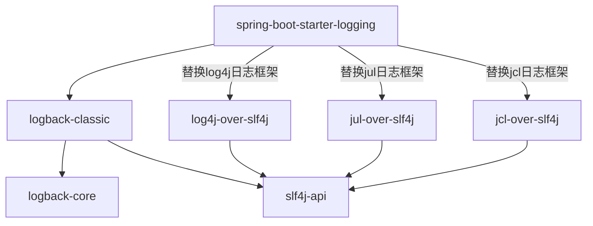
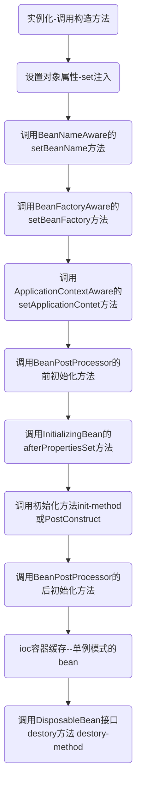

### SpringBoot

用于简化Spring中的配置

### 自动配置原理

`@SpringBootApplication`

* SpringBoot的总配置类，标注到某个类上，SpringBoot就应该运行这个类的main方法来启动SpringBoot应用，此注解上有以下三个注解
  * `@SpringBootConfiguration`：表示是SpringBoot的配置类
    * `@Configuration`：表明是一个配置类，此注解上有一个注解
      * `@Component`：表明此注解是一个组件
  * `@EnableAutoConfiguration`：这个注解告诉 Spring Boot 根据你添加的 jar 依赖关系“猜测”你想要如何配置 Spring。由于`spring-boot-starter-web`添加了 Tomcat 和 Spring MVC，auto-configuration 假设您正在发展 web application 并相应地设置 Spring。
    * `@AutoConfigurationPackage`：用于自动配置包
      * `@Import(AutoConfigurationPackages.Registrar.class)`：给容器导入指定组件，将主配置类下的所有目录及子目录的所有组件导入容器(如controller，service等)
    * `@Import(AutoConfigurationImportSelector.class)`
      * 给容器中导入自动配置类，如aop，tx等的自动配置，给我们配置前端控制器，视图解析器等，通过读取spring-boot-autoconfiguration.jar下MATE-INF下的spring.factories文件读取自动配置项
  * `@ComponentScan(excludeFilters = { @Filter(type = FilterType.CUSTOM, classes = TypeExcludeFilter.class),
          @Filter(type = FilterType.CUSTOM, classes = AutoConfigurationExcludeFilter.class) })`

> **Starters和 Auto-configuration**
>
> Auto-configuration 旨在与“Starters”很好地配合，但这两个概念没有直接联系。您可以自由选择 starters 之外的 jar 依赖项。 Spring Boot 仍然会自动配置你的应用。

###  配置文件

在idea中导入以下依赖，编写yaml时会有提示:

```xml
<dependency>
    <groupId>org.springframework.boot</groupId>
    <artifactId>spring-boot-configuration-processor</artifactId>
    <optional>true</optional>
</dependency>
```

##### yaml语法

* key:(空格)value

* 使用空格缩进

* 使用空格来控制层级关系，同级之间空格相同

  ```yaml
  # 表示server下的port属性值为8081
  server:
      port: 8081
  ```

* 大小写敏感

* 字面量的表示
  * 字符串默认不加单引号或双引号

  * 单引号：原样输出

  * 双引号：转义\n等字符

* 对象的表示

  ```yaml
  #换行写法
  person: 
      name: zhangsan
      age: 1
      gender: 男
  #行内写法
  person: {name: zhangsan,age: 1,gender: 男}
  
  cat:
     - name: zs
       gender: 1
     - name: ls
       gender: 0
  ```

* 集合的表示

  ```yaml
  #使用-(空格)value来表示值
  pets: 
    - dog
    - cat
    - pig
  #行内写法
  pets: [dog,pig,cat]
  # map 集合
  maps: {key1: value1,key2: value2}
  ```

##### 值的获取

1. **==@ConfigutationProperties==**

   在Javabean上使用@ConfigutationProperties(prefix="xxx")注解将yaml配置文件中的值赋给对象

   xxx为对象在yaml中的名字

   ```yaml
   person: 
       name: zhangsan
       age: 1
       gender: 男
   ```

   ```java
   @Conponment
   @ConfigutationProperties(prefix="person")
   public class person {
       private String name;
       private int age;
       private String gender;
       //...
   }
   ```

   此时，会将yaml配置文件中的person对象，赋给javabean的Person。==**（注意要使用@Componment）**==

   >   可以同时使用==@Validated==在类上注解对注入的数据进行校验，但是需要导入==JSR-303==数据校验的实现，比如hibernate对于数据校验的实现。如@NotNull,@Max(),@Email等对注入数据进行校验，不允许为null，最大值，必须为邮箱格式等。
   >
   >   内部类中属性校验还需要@Valid注解
   
   ```xml
   <!--hibernate对jsr303的实现-->
   <dependency>
       <groupId>org.hibernate</groupId>
       <artifactId>hibernate-validator</artifactId>
       <version>5.2.0.Final</version>
   </dependency>
   ```
   
   **与@Value的区别**
   
   |           Feature           | @ConfigurationProperties |      @Value      |
   | :-------------------------: | :----------------------: | :--------------: |
   | 松散绑定(驼峰、下划线、-等) |           Yes            | Limited(驼峰和-) |
   |         元数据支持          |           Yes            |        No        |
   |     SpEL表达式(#{xxx})      |            No            |       Yes        |
   |    复杂类型绑定(集合等)     |           Yes            |        No        |
   
2. ==@PropertySource==

   用于获取properties文件中的值

   使用==@Value==属性表示prop文件的位置

   ```properties
   # person.properties
   name=zhangsan
   age=14
   
   ```

   ```java
   @Conponent
   @PropertySource(value="classpath:person.properties")
   public class person {
       
       @value(${name})
       private String name;
       @value(${age})
       private int age;
       //...
   }
   ```

##### 配置文件的导入

之前我们可以通过listener或filter在服务器启动时导入applicationContext.xml文件，现在没有了web.xml文件，我们需要使用注解倒入配置文件。

在SpringBoot的总配置类上使用@ImportResrouce注解来导入配置文件

```java
@SpringBootApplication
@ImportResrouce(locations="classpath:applicationContext.xml")
public class HelloApplication {

    public static void main(String[] args) {
        SpringApplication.run(HelloApplication.class, args);
    }

}
```

在SpringBoot中推荐我们使用基于Java的容器配置来使用ioc容器，而不是使用配置文件。(Spring中学到的@Configuration注解和@Bean注解)

```java
//表示是一个配置文件
@Configuration
public class MyConfig{

    @Bean
    public User user(){
        return new User();
    }
}
```

##### 配置文件的占位符

在配置文件中可以使用占位符${xxx}来进行一些操作。

* 随机数、uuid

  ```yaml
  person:
    pid: ${random.uuid}
    # 生成zhangsan[1-10]中任一个
    name: zhangsan${random.int[10]}
  ```

* 引用前面的定义

  ```yaml
  person:
    name: zhangsan
   
  # 引用前面的person的name属性
  # :后面为默认值，即找不到设置的属性的默认值
  # 此时owner值为zhangsan_dog
  # 若删去前面的person，值为lisi_dog
  dog:
    owner: ${person.name:lisi}_dog
  ```

##### 多环境配置profile

* properties/yml
  * 可以给配置文件命名为application-xxx.properties/yml 的形式
  * 在主配置文件激活指定的配置文件

```properties
# Resource目录下可以有多个profile配置文件
application.properties
application-dev.properties
application-test.properties

#在主配置文件下application.properties写上想要激活的profile文件
spring.profile.active=dev
```

* yaml

  * yaml文件可以不用写多个配置文件，使用`---`分割出不同的文档块
  * 在主文档块中使用激活指定配置

  ```yaml
  server:
    port: 8081
    
  # 激活dev的环境配置，实际开发使用命令行激活
  spring:
    profiles:
      active: dev
      
  ---
  # 第二个文档块环境,用于开发
  server:
    port: 8082
  spring:
    profiles: dev
    
  ---
  # 第三个文档块环境,用于测试
  server:
    port: 8083
  spring:
    profiles: test
  ```

* 使用命令行

  * 虚拟机参数

    在idea的VM options中设置`-Dspring.profiles.active=xxx`

  * 命令行参数

    在Program arguments中设置`--spring.profiles.active=xxx`或是命令行启动时添加

  命令行方式的级别比配置文件中指定的级别高，同时指定时，使用命令行的配置。

##### 配置文件的位置

spring boot 启动会扫描以下位置的application.properties或者application.yml文件作为Spring boot的默认配置文件。

```properties
 # config目录与src为同一级目录
file:./config/application.yml
 # application.yml与src为同一级
-file:./application.yml
# Resource目录下的config目录
-classpath:/config/application.yml
# 类路径下,即resource下
-classpath:/application.yml
```

文件优先级从高到低的顺序，**所有位置的文件都会被加载**，高优先级配置内容会覆盖低优先级配置内容。文件之间会有==**互补配置**==。

没有在类路径的两种配置文件在打包时，不会被打包到jar中。

我们可以通过使用命令行配置spring.config.location来改变默认配置文件的位置。适用于项目已经打包但需要修改配置文件的时候。

```
java -jar xxx-0.0.1-SNAPSHOP.jar --spring.config.location=D:\application.yml
```

##### 外部配置文件

Spring Boot可以使用外部配置，以便可以在不同环境中使用相同的应用程序代码。

官方文档列出了17种方式，详情看[官方文档](https://docs.spring.io/spring-boot/docs/2.2.6.RELEASE/reference/html/spring-boot-features.html#boot-features-external-config)。

1. ==命令行参数==

   ​	```java -jar aaa-0.0.1-SNAPSHOT.jar --server.port=8087 --spring-context-path=/abc```

2. 来自java:comp/envjNDI属性

3. Java系统属性（System.getProperties（））

4. 操作系统环境变量I

5. RandomValuePropertySource配置的random.*属性值

   

   ==**优先加载带有profile的配置文件，再优先加载外部配置文件**==

   加载外部文件时，配置文件与jar在同一目录，然后使用命令行

   ​	```java -jar aaa-0.0.1-SNAPSHOT.jar```

6. ==jar包外部的application-{profile}.properties或application.yml（带spring.profile）配置文件==

7. ==jar包内部的application-{profile}.properties或application.yml（带spring.profile）配置文件==

8. ==jar包外部的application.properties或application.yml（不带spring.profile）配置文件==

9. ==jar包内部的application.properties或application.yml（不带pring.profile）配置文件==

10. @Configuration注解类上的@PropertySource
2. 通过SpringApplication.setDefaultProperties指定的默认属性

以上的顺序即为优先级，优先级高的会覆盖优先级低的，配置之间互补。

### 日志

SpringBoot底层使用commons-logging(JCL)门面实现日志功能。但JCL在2014以后不再更新，因此springboot使用适配器模式，对jcl进行了适配，从而使用slf4j日志框架和logback日志实现。

使用slf4j的日志门面，使用log4j的实现，需要再导入slf4j的log4j适配层进行转换。SpringBoot内部包装了(**==适配器模式==**)JCL，从而使用slf4j框架和logback日志实现，因此不需要我们导入。

##### 日志统一问题

spring默认使用commons-logging，hibernate默认使用jboss-logging，每个框架使用的日志可能不同，如果我们想要统一日志使用slf4j，就需要替换掉这些日志门面。


SpringBoot能自动适配所有的日志，而且底层使用slf4j+ogback的方式记录日志，引入其他框架的时候，只需要把这个框架依赖的日志框架排除掉；

```xml
<dependency>
    <groupId>org.springframework</groupId>
    <artifactId>spring-core</artifactId>
    <!-- spring默认就排除了jcl的日志门面，使用jcl-over-slf4j.jar替换了jcl，
    我们在其他框架的时候也需要排除其日志，使用slf4j-->
    <exclusions>
        <exclusion>
            <groupId>commons-1ogging</groupId>
            <artifactId>commons-logging</artifactId>
        </exclusion>
    </exclusions>
</dependency>
```



<div align="center">SpringBoot的日志的内部原理</div>

* 可以直接在配置文件中设置日志的配置，但一般在类路径下使用日志的配置文件。

  logback的文件名为logback.xml或logback-spring.xml。

  使用logback.xml有日志框架直接读取配置文件，使用logback-spring.xml将由spring读取配置文件。

  使用logback-spring.xml时可以使用自定义配置环境。

  ```xml
  <!--只有dev环境使用指定的配置-->
  <springProfile name="dev">
      xxx
  </springProfile>
  <!--非dev环境使用其他配置-->
  <springProfile name="!dev">
      xxx
  </springProfile>
  ```
##### 切换日志框架

  例如：切换slf4j的日志框架为log4j

  ```mermaid
  graph TD
  A[spring-boot-starter-logging]-->|替换jul日志框架|D[jul-over-slf4j]
  A[spring-boot-starter-logging]-->|替换jcl日志框架|E[jcl-over-slf4j]
  B[slf4j-log4j12]-->C[log4j]
  B-->|用slf4japi适配log4j|G
  
  D-->G[slf4j-api]
E-->G[slf4j-api]
  ```

  * 去除slf4j的实现logback
  * 添加slf4j对log4j的接口适配包
  * 添加log4j

### web开发

##### SpringMVC的自动配置

Spring Boot 为 Spring MVC 提供自动配置，适用于大多数应用场景。

自动配置在 Spring 的基础上添加了以下 features：

* `ContentNegotiatingViewResolver`和`BeanNameViewResolver` beans。
  * 自动配置视图解析器，以便解析视图。
  * 自动注册自定义的视图解析器
  
* 提供对静态资源，包括对 WebJars 的支持。
  
  * 默认会到类路径下的`/public`，/`static`，`/resources` 或 `/META-INF/resource`查找静态资源
  * 自定义配置 `spring.resources.static-locations`
  
* 自动注册 `Converter` ，`GenericConverter` 和 `Formatter` beans。
  * `Converter` [转换器](https://docs.spring.io/spring/docs/5.2.5.RELEASE/spring-framework-reference/core.html#core-convert)，例如将前端的表单转换为 `User` 对象，字符串转换为num等
  * `GenericConverter` 泛型转换器，实现更加复杂转换的转换器
  * `Formatter` 格式化器，一般用于num和日期的格式化
    * `spring.mvc.date-format=yyyy-MM-dd`
  
* 支持 `HttpMessageConverters`。
  
  * 转换 HTTP 的请求和响应，例如在@Controller中将页面的json的`User ` 转换为Java对象，或将Java对象转换为json发送到前端
  * 需要添加或者自定义转换器（converter），可以使用 Spring Boot 的 `HttpMessageConverters` 
  
* 自动注册`MessageCodesResolver`。
  * 用于从验证错误代码构建消息代码的策略接口，如转发到对应的错误页面
  * spring的数据验证接口`Validator`也有使用到。
  
* 静态 `index.html` 支持。
  
  * 用于设置首页，查找任一静态资源文件夹下，名为index.html。
  
* 自定义 `Favicon` 支持。
  
  * classpath 静态资源下中查找 `favicon.ico`
  
* 自动使用`ConfigurableWebBindingInitializer` bean。
  
  * 数据绑定，如将网页数据封装到`User`，它会调用转换器、校验器等。
  
* 模版引擎支持

    * thymeleaf和freemarker等

* 自定义错误页面

    * 静态资源目录下的/error文件夹，名称为错误码

    ```ini
    src/
     +- main/
         +- java/
         |   + <source code>
         +- resources/
             +- public/
                 +- error/
                 |   +- 404.html
                 +- <other public assets>
    ```

* CORS 支持

    * 跨域资源共享（Cross-origin resource sharing，CORS）
    *  使用`@CrossOrigin`注解到@Controller方法上启用 CORS

类似jquery这种静态资源我们可以以webjars的方式，在maven中以依赖的方式进行导入。

```java
//在WebMvcAutoConfiguration.class中
public void addResourceHandlers(ResourceHandlerRegistry registry) {
			if (!this.resourceProperties.isAddMappings()) {
				logger.debug("Default resource handling disabled");
				return;
			}
			Duration cachePeriod = this.resourceProperties.getCache().getPeriod();
			CacheControl cacheControl = this.resourceProperties.getCache().getCachecontrol().toHttpCacheControl();
			if (!registry.hasMappingForPattern("/webjars/**")) {
				customizeResourceHandlerRegistration(registry.addResourceHandler("/webjars/**")
						.addResourceLocations("classpath:/META-INF/resources/webjars/")
						.setCachePeriod(getSeconds(cachePeriod)).setCacheControl(cacheControl));
			}
```

显示我们导入的webjars位于`classpath:/META-INF/resources/webjars/`下，它的访问路径是`/webjars/**`

例如我们导入jquery的webjars。

```xml
<dependency>
    <groupId>org.webjars</groupId>
    <artifactId>jquery</artifactId>
    <version>1.12.4</version>
</dependency>
```

此时，其访问路径是`localhost:8080/项目/webjars/jquery/1.12.4/jquery.js`。

对于普通静态资源

```java
/**
 * Path pattern used for static resources.
 */
private String staticPathPattern = "/**";


String staticPathPattern = this.mvcProperties.getStaticPathPattern();
			if (!registry.hasMappingForPattern(staticPathPattern)) {
				customizeResourceHandlerRegistration(registry.addResourceHandler(staticPathPattern)
						.addResourceLocations(getResourceLocations(this.resourceProperties.getStaticLocations()))
						.setCachePeriod(getSeconds(cachePeriod)).setCacheControl(cacheControl));
			}


@ConfigurationProperties(prefix = "spring.resources", ignoreUnknownFields = false)
public class ResourceProperties {
    private static final String[] CLASSPATH_RESOURCE_LOCATIONS = { "classpath:/META-INF/resources/",
                "classpath:/resources/", "classpath:/static/", "classpath:/public/" };
    private String[] staticLocations = CLASSPATH_RESOURCE_LOCATIONS;
```

可以在以下五个位置

```"classpath:/META-INF/resources/",
classpath:/META-INF/resources/
classpath:/resources/
classpath:/static/
classpath:/public/
/
```

可以使用 `spring.resources.staticLocations` 更改

##### 扩展SpringMVC

如果你想保留 SpringBoot MVC features 并且想要添加额外的[MVC configuration](https://docs.spring.io/spring/docs/5.1.3.RELEASE/spring-framework-reference/web.html#mvc)(拦截器，FORMATTER，视图解析器和其他 features)，你可以添加自己的 `@Configuration`  class 实现`WebMvcConfigurer`，但**不要使用** `@EnableWebMvc`注解。（这个表示全面接管WebMvc，所有配置都失效，需要自己配置）

> **注意：**
>
> 在SpringBoot2.0，spring5.0以前，继承 `WebMvcConfigurationAdapter` 来进行拓展，之后版本`WebMvcConfigurationAdapter` 被废弃，需要实现`WebMvcConfigurer`，**==不推荐继承 WebMvcConfigurationSupport,==**因为 `WebMvcAutoConfiguration` 的类上有注解`@ConditionalOnMissingBean(WebMvcConfigurationSupport.class)`，即当没有  `WebMvcConfigurationSupport.class`类的时候自动配置才会生效，==**若想要继承该类，除了方法内自定义配置，还要调用父类的方法。**==如果你实现这也是使用 `@EnableWebMvc` 时会全面接管springMVC配置的原因。

如果您希望提供`RequestMappingHandlerMapping`，`RequestMappingHandlerAdapter`或`ExceptionHandlerExceptionResolver`的自定义实例，则可以声明`WebMvcRegistrationsAdapter`实例以提供此类组件。

如果要完全控制 Spring MVC，可以添加自己的`@Configuration`注释`@EnableWebMvc`。然后在自定义配置中添加自己的拦截器、资源映射等。

```java
@Configuration
public class MyConfig implements WebMvcConfigurer{
    
    // 添加自定义视图映射，用于视图跳转，将/index请求映射到指定路径下的main.html
    @Override
    public void addViewControllers(ViewControllerRegistry registry) {
        registry.addViewController("/index").setViewName("main");
    }
    
    // 将自定义拦截器添加到自动配置类中
    @override
    public void addInterceptors(ResourceHandlerRegistry registry){
        registry.addnterceptor(registry
                               .addInterceptor(new MyInterceptor())
                               // 拦截所有
                               .addPathPatterns("/**")
                               // 排除静态资源
                               .excludePathPatterns("/emp/toLogin",
                                                    "/emp/login",
                                                    "/js/**",
                                                    "/css/**",
                                                    "/images/**"););
    }
    
    // 自定义静态资源映射目录，/my/**的url路径下的资源将去classpath:/my/下找
    @Override
    public void addResourceHandlers(ResourceHandlerRegistry registry) {
        registry.addResourceHandler("/my/**").addResourceLocations("classpath:/my/");
    }
    
    // 默认静态资源处理器
    @Override
    public void configureDefaultServletHandling(DefaultServletHandlerConfigurer configurer) {
        configurer.enable();
        configurer.enable("defaultServletName");
    }
    
    // 配置视图解析器
    @Override
    public void configureViewResolvers(ViewResolverRegistry registry) {
        super.configureViewResolvers(registry);
        registry.viewResolver(resourceViewResolver());
        /*registry.jsp("/WEB-INF/jsp/",".jsp");*/
    }
    
    // 拓展异常处理解析器
    public void extendHandlerExceptionResolvers(List<HandlerExceptionResolver> resolvers) {
	}
    
    // 跨域问题
    @Override
    public void addCorsMappings(CorsRegistry registry) {
        super.addCorsMappings(registry);
        registry.addMapping("/cors/**")
            .allowedHeaders("*")
            .allowedMethods("POST","GET")
            .allowedOrigins("*");
    }
    
    // 信息转换器
    @Override
    public void configureMessageConverters(List<HttpMessageConverter<?>> converters) {
        //调用父类的配置
        super.configureMessageConverters(converters);
        //创建fastJson消息转换器
        FastJsonHttpMessageConverter fastConverter = new FastJsonHttpMessageConverter();
        //创建配置类
        FastJsonConfig fastJsonConfig = new FastJsonConfig();
        //修改配置返回内容的过滤
        fastJsonConfig.setSerializerFeatures(
            SerializerFeature.DisableCircularReferenceDetect,
            SerializerFeature.WriteMapNullValue,
            SerializerFeature.WriteNullStringAsEmpty
        );
        fastConverter.setFastJsonConfig(fastJsonConfig);
        //将fastjson添加到视图消息转换器列表内
        converters.add(fastConverter);

    }
    
    // 自定义方法参数解析器
    @Override
    public void addArgumentResolvers(List<HandlerMethodArgumentResolver> resolvers) {
        resolvers.add(new AuthenticationArgumentResolver());
        resolvers.add(pageableResolver);
        resolvers.add(sortResolver);
    }
}
```

```java
// 自定义拦截器
@Conponent
public class MyInterceptors implements HandlerInterceptor{
    //实现三个方法
}
```

###### 拦截器

Spring MVC中的拦截器（Interceptor）类似于Servlet中的过滤器（Filter），不依赖于servlet容器。它主要用于==**拦截用户请求**==并作相应的处理。例如通过拦截器可以进行权限验证、记录请求信息的日志、判断用户是否登录等。

要使用Spring MVC中的拦截器，就需要对拦截器类进行定义和配置。通常拦截器类可以通过两种方式来定义。

1.  通过实现HandlerInterceptor接口，或继承HandlerInterceptor接口的实现类（如HandlerInterceptorAdapter）来定义。

2.  通过实现WebRequestInterceptor接口，或继承WebRequestInterceptor接口的实现类来定义。

```java
public class MyInterceptor implements HandlerInterceptor {
    //在请求处理之前进行调用（Controller方法调用之前
    @Override
    public boolean preHandle(HttpServletRequest httpServletRequest, HttpServletResponse httpServletResponse, Object o) throws Exception {
       
    }
 
    //请求处理之后进行调用，但是在视图被渲染之前（Controller方法调用之后）
    @Override
    public void postHandle(HttpServletRequest httpServletRequest, HttpServletResponse httpServletResponse, Object o, ModelAndView modelAndView) throws Exception {
       
    }
 
    //在整个请求结束之后被调用，也就是在DispatcherServlet 渲染了对应的视图之后执行（主要是用于进行资源清理工作）
    @Override
    public void afterCompletion(HttpServletRequest httpServletRequest, HttpServletResponse httpServletResponse, Object o, Exception e) throws Exception {
       
    }
}
```

然后实现`WebMvcConfigurer.addInterceptors()`方法，添加拦截器。

>   与过滤器的区别
>
>   最简单明了的区别就是**过滤器可以修改request，而拦截器不能，
>   过滤器需要在servlet容器中实现，拦截器可以适用于javaEE，javaSE等各种环境
>   拦截器可以调用IOC容器中的各种依赖，而过滤器不能
>   过滤器只能在请求的前后使用，而拦截器可以详细到每个方法**
>
>   拦截器只能对action请求起作用，而过滤器则可以对几乎所有的请求起作用
>
>   总的来说，过滤器就是筛选出你要的东西，比如requeset中你要的那部分
>
>   拦截器在做安全方面用的比较多，比如终止一些流程
>
>   执行顺序 ：过滤前 - 拦截前 - Action处理 - 拦截后 - 过滤后。

###### HandlerMethodArgumentResolver

用于解析request请求参数并绑定数据到Controller的入参

```java
public interface HandlerMethodArgumentResolver {

	/**
	 * 判断当前解析器是否支持解析
	 * @param parameter 是被调用的Controller的方法的参数的类型
	 */
	boolean supportsParameter(MethodParameter parameter);

	/**
	 * 如果上面支持解析，进行解析操作
	 */
	@Nullable
	Object resolveArgument(MethodParameter parameter, @Nullable ModelAndViewContainer mavContainer,
			NativeWebRequest webRequest, @Nullable WebDataBinderFactory binderFactory) throws Exception;

}
```

###### Converter

转换器，` T convert(S source)`，将一个类型转换为另一个类型，如将Long转换为Date，将String转换为Date等。可以用在任意层，注意与Formatter的区别。

```java
// 将yyyy-MM-dd格式字符串转换为Date
public class StringToDateConverter implements Converter<String, Date>{
 
    public StringToDateConverter(String pattern) {
        super();
        this.pattern = pattern;
    }
 
    // 转换的方法
    @Override
    public Date convert(String date) {  
        //  yyyy-MM-dd 
        SimpleDateFormat sd = new SimpleDateFormat("yyyy-MM-dd");
        try {
            return sd.parse(date);
        } catch (ParseException e) {
            //e.printStackTrace();
            throw new IllegalAccessError("日期转换出错！！");
        }
    }
 
}
```

###### Formatter

Formatter 与 Converter<S，T> 一样，也是一个可以将一种数据类型转换成另一种数据类型的接口。不同的是，Formatter 的源数据类型必须是 String 类型，而 Converter<S，T> 的源数据类型是任意数据类型。

在 Web 应用中由 HTTP 发送的请求数据到控制器中都是以 String 类型获取，因此在 Web 应用中选择 Formatter\<T> 比选择 Converter<S，T> 更加合理。

```java
/**
	这里的T表示输入字符串要转换的目标类型。
	parse方法利用指定的Locale将一个String解析成目标类型。
	print方法相反，它是返回目标对象的字符串
表示法。
*/

public interface Formatter<T> extends Printer<T>,Parser<T>{}

public interface Printer<T>{
    string print(T var1,Locale var2);
}

public interface Parser<T>{
    T parse(string var1,Locale var2)throws ParseException;
}
```


##### 模版引擎

类似jsp，可以将Java数据使用类似el表达式的方式嵌套到html页面中，常用的有thymeleaf、freemarker，前端框架vue等可以实现类似功能。模版引擎的资源默认 `src/main/resources/templates` 下自动获取。

##### 国际化

编写i18n国际化文件，一般放在类路径的i18n文件夹下，springboot的 **`MessageSourceAutoConfiguration` **会在查找类路径下messages的文件，我们修改为i18n下的文件，需要更改默认路径

`spring.message.basename=i18n.aaa`表示i18n文件夹下的aaa文件。

```
|--Resource
	 |--i18n
	 	|--aaa.propertie
	 	|--aaa_zh_CN.properties
	 	|--aaa_en_US.properties
```

原理：

​	Locale（区域信息对象）；LocaleResolver（获取区域信息对象）；

Spring默认从请求头**Accept-Language**中获取语言信息，我们有时想要通过点击按钮来进行切换时(不会改变请求头信息)，这时可以通过在请求路径中携带zh-CN或en-US的方式(如Dubbo的网址)，然后使用自定义区域解析器获得指定语言信息。

编写自定义的区域信息解析器

```java
public class MyLocaleResolver implements LocaleResolver {
    @Override
    public Locale resolveLocale(HttpServletRequest request) {
        String language = request.getParameter("lang");
        // 获取默认区域信息,若没有发送语言信息时使用默认设置
        Locale locale = Locale.getDefault();
        //如果请求中包含语言信息
        if (!language.trim().isEmpty()) {
            String[] langAndCountry = language.split("_");
            locale = new Locale(langAndCountry[0], langAndCountry[1]);
        }
        return locale;
    }

    @Override
    public void setLocale(HttpServletRequest request, HttpServletResponse response, Locale locale) {
        
    }
}
```

将区域信息解析器添加到自定义的web'配置中

```java
@Configuration
public class MyConfig implements WebMvcConfigurer{
   @Bean
    public
}
```

##### rest风格

使用rest风格需要使用PUT、DELETE等提交方式，默认只支持GET和POST

想要使用其他方式，需要设置HiddenHttpMethodFilter,默认为关闭，需要设置属性来开启。

```yaml
spring:
  mvc: 
    hiddenmethod:
      filter:
        enabled: true
```

使用

PUT、DELETE需要使用表单的POST方式，添加隐藏域，指定提交方式

```html
<form action="/xxx" method="post">
    <input type="hidden" name="_method" value="[put|delete]"/>
</form>
```

### 校验

springboot项目可直接引入依赖

```xml
<dependency>
    <groupId>org.springframework.boot</groupId>
    <artifactId>spring-boot-starter-validation</artifactId>
</dependency>
```

##### 常用注解

* `@NotEmpty` 被注释的字符串的不能为 null 也不能为空

* `@NotBlank` 被注释的字符串非 null，并且必须包含一个非空白字符

* `@Null` 被注释的元素必须为 null

* `@NotNull` 被注释的元素必须不为 null

* `@AssertTrue` 被注释的元素必须为 true

* `@AssertFalse` 被注释的元素必须为 false

* `@Pattern(regex=,flag=)`被注释的元素必须符合指定的正则表达式

* `@Email` 被注释的元素必须是 Email 格式。

* `@Min(value)`被注释的元素必须是一个数字，其值必须大于等于指定的最小值

* `@Max(value)`被注释的元素必须是一个数字，其值必须小于等于指定的最大值

* `@DecimalMin(value)`被注释的元素必须是一个数字，其值必须大于等于指定的最小值

* `@DecimalMax(value)` 被注释的元素必须是一个数字，其值必须小于等于指定的最大值

* `@Size(max=, min=)`被注释的元素的大小必须在指定的范围内

* `@Digits (integer, fraction)`被注释的元素必须是一个数字，其值必须在可接受的范围内

* `@Past`被注释的元素必须是一个过去的日期

* `@Future` 被注释的元素必须是一个将来的日期

  

>   注意：引入javax.validation.constraints下的注解，而不是spring的。

##### 简单使用

```java
@Data
public class Student {
    
    @Max(299)
    @NotNull(message = "学生身高不能为空")
    private Integer stature;

    @NotNull(message = "学生姓名不能为空")
    private String name;
}
```

在Controller需要验证的参数前面加上 `@Validated` 注解, 对象中的 `@NotNull、@Max` 等注解才会生效, 不加的话是无效的。`@Validated`是spring对jsr303的一个实现，相对于`@Valid`(javax对于jsr303的实现)，增加了分组等功能。

```java
@PostMapping(value = "save")
public void save(@Validated @RequestBody StudentVO studentVO) {
    ...
}
```

##### BindResult

如果==**校验不通过，会直接抛出异常**==，我们可以在Controller参数中添加`BindResult`参数，mvc会将验证的结果自动封装在`BindResult`中，我们获取其结果，进行判断是否有错误。

```java
@PostMapping("/badHandle")
public ResuitBean<?> testUnknownException(@Valid @RequestBody Account account,
                                          BindingResult result) {
    if(result.hasErrors()){
        List<ObjectError> allErrors = result.getAllErrors();
        StringBuilder sb = new StringBuilder();
        allErrors.forEach(error -> 
                          sb.append(error.getDefaultMessage()).append("；"))；
            log.warn("参数校验不通过,失败信息:{}",sb.toString())；
            return ResultBean.fail(sb.toString());
    }
    
    return ResultBean.success(accountService.insert(account));
}
```

>   注意：若有多个验证参数，==**每个验证参数都需要一个** *BindResult*==，紧跟在验证参数后面。

##### 全局异常捕获

每个Controller方法进来都要处理结果，也很麻烦，我们可以使用全局异常捕获来处理异常。

可能共有以下异常需要处理

-   **对象参数**接收请求体： **MethodArgumentNotValidException**（继承BindException）
-   **请求参数绑定到对象参数**上： **BindException**
-   **普通参数**： **ConstraintViolationException**
-   **必填参数没传：ServletRequestBindingException**
    -   **请求参数**缺失：**MissingServletRequestParameterException**
    -   **路径参数**缺失：**MissingPathVariableException**

```java
@ExceptionHandler({ConstraintViolationException.class,
                   MethodArgumentNotValidException.class,
                   ServletRequestBindingException.class,
                   BindException.class})
@ResponseBody
public ResultBean<?> handleValidationException(Exception e) {
    String msg = "";
    if (e instanceof MethodArgumentNotValidException) {
        MethodArgumentNotValidException t = (MethodArgumentNotValidException) e;
        msg = getBindingResultMsg(t.getBindingResult());
    } else if (e instanceof BindException) {
        BindException t = (BindException) e;
        msg = getBindingResultMsg(t.getBindingResult());
    } else if (e instanceof ConstraintViolationException) {
        ConstraintViolationException t = (ConstraintViolationException) e;
        msg = t.getConstraintViolations().stream()
            .map(ConstraintViolation::getMessage)
            .collect(Collectors.joining(","));
    } else if (e instanceof MissingServletRequestParameterException) {
        MissingServletRequestParameterException t = (MissingServletRequestParameterException) e;
        msg = t.getParameterName() + " 不能为空";
    } else if (e instanceof MissingPathVariableException) {
        MissingPathVariableException t = (MissingPathVariableException) e;
        msg = t.getVariableName() + " 不能为空";
    } else {
        msg = "必填参数缺失";
    }
    log.warn("参数校验不通过,msg: {}", msg);
    return ResultBean.fail(msg);
}
```

##### 手动校验

Validation.buildDefault ValidatorFactory().getValidator().validate(xxx)

##### @Validated 高级用法

分组 - groups

上面的例子，若我们想要修改身高，此时，姓名不需要修改，而`name`字段已被校验为`@NotNull`，我们不能要求再输一遍姓名，此时可以使用分组。

创建接口，用于标识

```java
public interface Update {}
```

```java
@NotNull(message = "学生姓名不能为空", groups = {Update.class})
private String name;


@PostMapping(value = "update")
public void update(@Validated({Update.class}) @RequestBody StudentVO studentVO) {
 ...
}

@PostMapping(value = "save")
public void save(@Validated(@RequestBody StudentVO studentVO) {
 ...
}
```

此时，只有save操作会校验name，而update操作不用校验。

### JDBC

数据库连接池

​	默认支持tomcat，Hakari，dbcp(2.0以后不默认支持)，dbcp2

自动配置DataSource，在spring.datasource配置

##### datasource的配置

```yaml
spring:
    datasource:
        driver-class-name: com.mysql.jdbc.Driver
        url: jdbc:mysql://localhost:3306/halo?useSSL=false&serverTimezone=Asia/Shanghai&characterEncoding=utf8
        username: root
        password: 1234
        # 除去默认支持的连接池，其他数据库连接池需要指定type(全限定类名)
        type: com.alibaba.druid.pool.DruidDataSource
```

Druid数据源的基本配置，导入druid-spring-boot-starter依赖

Druid的其他属性设置可参考Druid Wiki，[Druid DataSource 配置]([https://github.com/alibaba/druid/wiki/DruidDataSource%E9%85%8D%E7%BD%AE%E5%B1%9E%E6%80%A7%E5%88%97%E8%A1%A8](https://github.com/alibaba/druid/wiki/DruidDataSource配置属性列表))。

```yaml
spring:
  datasource:
    druid:
        # 连接池设置，与dbcp类似，此处也可配置url，username，password，先读取此处，若没有，读取spring.datasource下的
        initial-size: 10
        min-idle: 5
        max-active: 20
        max-wait: 60000
```

WebStatFilter用于采集web-jdbc关联监控的数据。

WebStatFilter配置，说明请参考Druid Wiki，[配置_配置WebStatFilter]([https://github.com/alibaba/druid/wiki/%E9%85%8D%E7%BD%AE_%E9%85%8D%E7%BD%AEWebStatFilter](https://github.com/alibaba/druid/wiki/配置_配置WebStatFilter))

```yaml
spring:
	datasource:
        # druid 监控配置
        
        web-stat-filter.enabled: #是否启用StatFilter，默认值false
        # 拦截路径
        web-stat-filter.url-pattern: /*
        # 经常需要排除一些不必要的url，比如*.js,/jslib/*等等。若是在web中xml配置在init-param			中。
        web-stat-filter.exclusions: "*.js,*.gif,*.jpg,*.png,*.css,*.ico,/druid/*"
        # 是否开启session统计功能
        web-stat-filter.session-stat-enable:
        # session统计的最大数，默认1000
        web-stat-filter.session-stat-max-count:
        web-stat-filter.principal-session-name:
        web-stat-filter.principal-cookie-name:
        web-stat-filter.profile-enable:

       
```

Druid内置提供了一个StatViewServlet用于展示Druid的统计信息。这个StatViewServlet的用途包括：

* 提供监控信息展示的html页面
* 提供监控信息的JSON API

StatViewServlet配置，说明请参考Druid Wiki，[配置_StatViewServlet配置]([https://github.com/alibaba/druid/wiki/%E9%85%8D%E7%BD%AE_StatViewServlet%E9%85%8D%E7%BD%AE](https://github.com/alibaba/druid/wiki/配置_StatViewServlet配置))

```yaml
 spring:
 	datasource:
        #是否启用StatViewServlet（监控页面）默认值为false（考虑到安全问题默认并未启动，如需启用建议设置密码或白名单以保障安全）
        stat-view-servlet.enabled: true
        # 访问哪个路径来访问内置监控页面,如下面的配置，访问127.0.0.1:8080/项目名/druid/index
        stat-view-servlet.url-pattern: /druid/*
        # 是否允许清空监控数据
        stat-view-servlet.reset-enable:
        # 监控页面的用户名及密码
        stat-view-servlet.login-username: admin
        stat-view-servlet.login-password: admin
        # 允许和拒绝哪些ip访问监控页面,不写，默认允许全部
        stat-view-servlet.allow:
        stat-view-servlet.deny:

        # Spring监控配置，说明请参考Druid Github Wiki，配置_Druid和Spring关联监控配置
        aop-patterns: # Spring监控AOP切入点，如x.y.z.service.*,配置多个英文逗号分隔
```

DruidDataSource支持通过Filter-Chain模式进行扩展，类似Serlvet的Filter，扩展十分方便，你可以拦截任何JDBC的方法。

例如上面的WebStatFilter,用于监控的filter

```yaml
spring:
	datasource:
		druid:
			# filters属性的配置使用别名或者全类名，stat是			com.alibaba.druid.filter.stat.StatFilter的别名。
			filters: "stat,wall"
```

Druid内置Filter的别名

|  Filter类名   | 别名                                                    |
| :-----------: | :------------------------------------------------------ |
|    default    | com.alibaba.druid.filter.stat.StatFilter                |
|     stat      | com.alibaba.druid.filter.stat.StatFilter                |
|   mergeStat   | com.alibaba.druid.filter.stat.MergeStatFilter           |
|   encoding    | com.alibaba.druid.filter.encoding.EncodingConvertFilter |
|     log4j     | com.alibaba.druid.filter.logging.Log4jFilter            |
|    log4j2     | com.alibaba.druid.filter.logging.Log4j2Filter           |
|     slf4j     | com.alibaba.druid.filter.logging.Slf4jLogFilter         |
| commonlogging | com.alibaba.druid.filter.logging.CommonsLogFilter       |
|     wall      | com.alibaba.druid.wall.WallFilter                       |

##### 与mybatis的整合

导入mybatis-spring-boot-starter依赖

* 使用配置文件

  在application.yml文件中使用

```yaml
mybatis:
    # mybatis配置文件的位置,实际使用配置代替
    config-location: classpath:xxx/xxx/SqlMapConfig.xml
    # mapper.xml文件的路径，
    mapper-locations: classpath:xxx/xxx/*.xml
    typeAliasesPackage: com.xxx.xxx.pojo
    # 其他设置等
 
# 开启SQL语句 
logging:
  level:
    mapper所在的包名: debug
```

>   ==推荐*Mapper.xml文件放到**src/main/resources**的类路径下==，不要放置在src/main/java的类路径下，因为xml文件可能会被过滤，从而在编译目录内没有对应的xml文件。

* ==使用注解==

  在springboot的主程序上使用@MapperScan注解来扫描指定路径下的mapper

  使用@Repository 注解标注在mapper类上来标识mapper，便于扫描

  也可以使用mybatis的注解@Mapper来代替上面两个的注解，其作用也是将mapper加入到ioc容器中，但是使用@Mapper，idea在注入时会有红色波浪线报错，不影响使用
  
  编写config类添加到容器中来代替配置文件
  
  >   实际工作中，不会全部采用注解的方式来使用mybatis，因为复杂sql语句使用注解不方便，还是会有配置文件的存在。
  
  MyBatis-Spring-Boot-Starter提供了一个`ConfigurationCustomizer`接口，实现该接口可以自定义MyBatis配置。
  
  >   注意 @MapperScan只是扫描Java类，对应的

##### 分页

使用pagehelper

```xml
<dependency>
    <groupId>com.github.pagehelper</groupId>
    <artifactId>pagehelper-spring-boot-starter</artifactId>
    <version>1.2.5</version>
</dependency>
```

配置

```yaml
# pagehelper   
pagehelper:
    helperDialect: mysql	# mysql的语法
    reasonable: true	# 合理化，当页数<1时设置为1
    supportMethodsArguments: true # 支持通过 Mapper 接口参数来传递分页参数
    params: count=countSql
```

代码

```java
@GetMapping("/getAllPerson")
public String getAllPerson(@RequestParam(defaultValue = "1",value = "pageNum") Integer pageNum){
    PageHelper.startPage(pageNum,5); // 第几页，每页数据
    List<Person> list = personService.getAllPerson();
    PageInfo<Person> pageInfo = new PageInfo<Person>(list); // 将list传给pageinfo即可
    model.addAttribute("pageInfo",pageInfo);
    return "list";
}
```


### 消息队列MQ

rabbitMQ

使用rqbbitTemple

### 缓存

通过 `@EnableCaching` 注解启用缓存支持，Spring Boot 就会自动配置缓存设置。

提供了redis的自动配置，引入`·`spring-boot-starter-data-redis`.

*   @Cacheable

```java
@Cacheable("xxx") // 将结果放到缓存中，xxx为该缓存的名字

// 缓存管理器
@Cacheable(cacheNames="books", cacheManager="anotherCacheManager") 
public Book findBook(ISBN isbn) {...}

// 加锁，synchronized
@Cacheable(cacheNames="foos", sync=true) 
public Foo executeExpensiveOperation(String id) {...}

// 条件缓存，spel表达式
@Cacheable(cacheNames="book", condition="#name.length() < 32") 
public Book findBook(String name)
```

*   @CachePut

    在查询以后，将结果更新到缓存中

*   `@CacheEvict`

    删除缓存

    ```java
    @CacheEvict(cacheNames="books", allEntries=true) 
    public void loadBooks(InputStream batch)
    ```

*   @Cache

    有时，需要指定相同类型的多个注解（例如@CacheEvict或@CachePut），例如，不同缓存之间的条件或键表达式不同。 @Caching允许在同一方法上使用多个嵌套的@ Cacheable，@ CachePut和@CacheEvict批注。

    ```java
    @Caching(evict = { @CacheEvict("primary"), @CacheEvict(cacheNames="secondary", key="#p0") })
    public Book importBooks(String deposit, Date date)
    ```

*   @CacheConfig

    用于提取多个cache中共同的部分，如@CacheConfig(cacheNames = "user")，用于类上

### 事件和监听

事件及监听并不是SpringBoot的新功能，Spring框架早已提供了完善的事件监听机制，在Spring框架中实现事件监听的流程如下：

1.  自定义事件，继承org.springframework.context.ApplicationEvent抽象类
2.  定义事件监听器，实现org.springframework.context.ApplicationListener接口
3.  在Spring容器中发布事件

`ApplicationListener` 继承自 `java.util.EventListener` ，用于一些事件监听和操作，在容器初始化完成之后来做一些资源载入或者一些组件的初始化。

*   事件类，这个用来描述事件本身一些属性，一般继承`ApplicationEvent`
*   监听类，用来监听事件后作出响应。需要实现 `ApplicationListener` 接口
*   事件发布类(事件源)，需要通过这个类将时间发布出去，这样才能被监听者监听到，需要实现`ApplicationContextAware`接口。
*   将事件类和监听类交给`Spring`容器。

```java
@Data
public class Order{
    private long id;
    private String name;
}

@RestcontrolLer
@RequestMapping("/order")
public class OrderController{
    
private OrderService orderService;
    
    @RequestMapping("/buy")
    public Order buy(){
        Order order=new Order(id:123,name:"RTX3090");
        orderService.buy(order);
        return order;
    }
}

// 创建事件
public class OrderSuccessEvent extends ApplicationEvent{
    
    private Order order；

        public OrderSuccessEvent(Object source){
        super(source);
    }
    public OrderSuccessEvent(Object source,Order order){
        super(source);
        this.order=order;
    }
}

// 监听器
@Component
public class SmsListener implements ApplicationListener<OrderSuccessEvent>{
    @Override
    public void onApplicationEvent(OrderSuccessEvent event){
        System.out.println("发送短信:"+event.getOrder().getName);
    }
}

// 事件源
@Service
public class OrderService implements ApplicationEventPublisherAware {
    private ApplicationEventPublisher publisher;

    public void buy(Order order) {
        System.out.println("下单成功:"+order);
        //发布享件
        publisher.publishEvent(new OrderSuccessEvent(this,order));
    }

    @Override
    public void setApplicationEventPublisher
        (ApplicationEventPublisher applicationEventPublisher){
        this.publisher = applicationEventPublisher;
    }
}
```

也可使用``@EventListener`注解来标注到方法上，不用继承`ApplicationListener`，还可设置条件。`Order`可设置优先级。

监听事件，默认是同步的，`@EnableAsync`到配置类，`@Async`到监听方法上，可异步多线程。

### bean的生命周期



