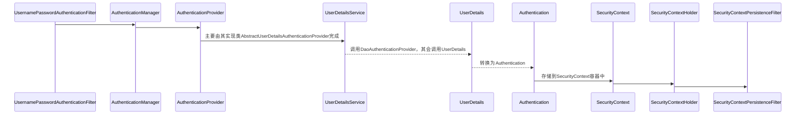
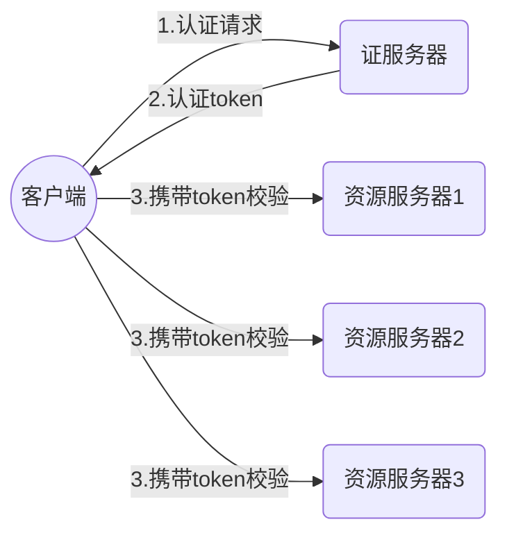

# 简介

spring security主要是为了认证和授权，即`authentication`/`authorization` 。无论你选择Apache Shiro 或者 Spring Security 都需要熟悉这两个概念。其实简单来说认证（authentication）就是为了证明`你是谁`，比如你输入账号密码证明你是用户名为2333的用户。而授权（authorization）是通过认证后的用户所绑定的角色等凭证来证明`你可以做什么` 。打一个现实中的例子。十一长假大家远行都要乘坐交通工具，现在坐车实名制，也就是说你坐车需要两件东西：`身份证`和`车票` 。身份证是为了证明你确实是你，这就是 `authentication`；而车票是为了证明你张三确实买了票可以上车，这就是 `authorization`。这个例子从另一方面也证明了。如果只有认证没有授权，认证就没有意义。如果没有认证，授权就无法赋予真正的可信任的用户。两者是同时存在的。

SpringSecurity是通过**过滤器链**的方式实现，经过一个过滤器，通过后执行下一个过滤器，直到所有过滤器通过。

其创建了了一个名为`springSecurityFilterChain`的过滤器，SpringSecurity通过这个过滤器链来进行全部认证和授权。

spring在过滤器链中加入了一个`DelegatingFilterChainProxy`过滤器，它是一个代理过滤器，作用是找到名为`springSecurityFilterChain`的过滤器，执行该过滤器。

在ssm中需要在web.xml中添加`DelegatingFilterChainProxy`过滤器，并指定过滤器的名字为`springSecurityFilterChain`，`DelegatingFilterChainProxy`过滤器的作用是找到名为`springSecurityFilterChain`的过滤器，然后让该过滤器执行其过滤内容。

在使用shiro时，也要指定`DelegatingFilterChainProxy`的名字为`shiroFilter`的过滤器执行。

springboot项目中，只要引入spring-security的启动器即可。

### RBAC模型

RBAC 是基于角色的访问控制（Role-Based Access Control ）的简称。在 RBAC 中，权限与角色相关联，用户通过成为适当角色的成员而得到这些角色的权限。这就极大地简化了权限的管理。这样管理都是层级相互依赖的，权限赋予给角色，而把角色又赋予用户，这样的权限设计很清楚，管理起来很方便。当你拥有某个角色以后，你自然继承了该角色的所有功能。对你的一些操作限制不需要直接与你进行沟通，只需要操作你拥有的角色。比如你在公司既是一个java程序员又是一个前端程序员，那么你不但要当sqlboy还要当页面仔。如果有一天经理说了前端负责测试工作，好了你又承担了测试任务。

# 原理及结构

### 原理

`DelegatingFilterChainProxy`


`FilterChainProxy`：过滤器链的代理


`SecurityFilterChain`：安全过滤器链


`Security Filters`：关于安全的过滤器

### 过滤器的顺序

-   ChannelProcessingFilter
-   WebAsyncManagerIntegrationFilter
-   SecurityContextPersistenceFilter
-   HeaderWriterFilter
-   CorsFilter
-   CsrfFilter
-   LogoutFilter
-   OAuth2AuthorizationRequestRedirectFilter
-   Saml2WebSsoAuthenticationRequestFilter
-   X509AuthenticationFilter
-   AbstractPreAuthenticatedProcessingFilter
-   CasAuthenticationFilter
-   OAuth2LoginAuthenticationFilter
-   Saml2WebSsoAuthenticationFilter
-   [`UsernamePasswordAuthenticationFilter`](https://docs.spring.io/spring-security/site/docs/5.4.2/reference/html5/#servlet-authentication-usernamepasswordauthenticationfilter)
-   OpenIDAuthenticationFilter
-   DefaultLoginPageGeneratingFilter
-   DefaultLogoutPageGeneratingFilter
-   ConcurrentSessionFilter
-   [`DigestAuthenticationFilter`](https://docs.spring.io/spring-security/site/docs/5.4.2/reference/html5/#servlet-authentication-digest)
-   BearerTokenAuthenticationFilter
-   [`BasicAuthenticationFilter`](https://docs.spring.io/spring-security/site/docs/5.4.2/reference/html5/#servlet-authentication-basic)
-   RequestCacheAwareFilter
-   SecurityContextHolderAwareRequestFilter
-   JaasApiIntegrationFilter
-   RememberMeAuthenticationFilter
-   AnonymousAuthenticationFilter
-   OAuth2AuthorizationCodeGrantFilter
-   SessionManagementFilter
-   [`ExceptionTranslationFilter`](https://docs.spring.io/spring-security/site/docs/5.4.2/reference/html5/#servlet-exceptiontranslationfilter)
-   [`FilterSecurityInterceptor`](https://docs.spring.io/spring-security/site/docs/5.4.2/reference/html5/#servlet-authorization-filtersecurityinterceptor)
-   SwitchUserFilter

### 结构

##### SecurityContextHolder

SecurityContextHolder是Spring Security存储身份验证的详细信息的地方。

SecurityContextHolder是Spring Security身份验证模型的核心。它包含SecurityContext。


SecurityContextHolder是Spring Security存储已经验证身份的用户详细信息的地方。Spring Security并不关心如何填充SecurityContextHolder。如果它包含一个值，那么它将作为当前已被认证用户来使用。

##### SecurityContext

安全上下文，从SecurityContextHolder获得，包含当前经过身份验证的用户的身份验证。

##### Authentication

可以是AuthenticationManager的输入，以给用户提供为进行身份验证而提供的凭证，或S代表ecurityContext的当前用户。

AuthenticationManager的输入，用于提供用户提供的用于进行身份验证的凭据。在这个场景中使用时，isAuthenticated()返回false。

也表示当前经过身份验证的用户。当前的身份验证可以从SecurityContext获得。

Authentication包含:

*   principal(主体)——标识用户。在使用用户名/密码进行身份验证时，这通常是UserDetails的实例。
*   credentials(凭证)——通常是密码。在许多情况下，在对用户进行身份验证以确保其不被泄露之后，将清除这些信息。
*   authorities(权限)——GrantedAuthoritys是授予用户的高级权限，如赋予角色。

##### GrantedAuthority

在身份验证中授予主体的权限(如角色、范围等)。

可以通过`Authentication.getAuthorities()`方法获得授予的authoritys，得到GrantedAuthority对象的集合。毫无疑问，授予的权限是授予给主体的权限。这些权限通常是“角色”，如``ROLE_ADMINISTRATOR`或`ROLE_HR_SUPERVISOR`。稍后将为web授权、方法授权和域对象授权配置这些角色。Spring Security的其他部分能够解释这些授权，并期望它们出现。

当使用基于用户名/密码的身份验证时，授予的authoritys通常由`UserDetailsService`加载。

##### AuthenticationManager

定义Spring Security过滤器如何执行身份验证的API。

##### ProviderManager

`AuthenticationManager`的最常见实现。

`ProviderManager`委托给`AuthenticationProvider`s列表。每个`AuthenticationProvider`都有机会指示认证应该成功，失败，或者表明它不能做出决定并允许下游`AuthenticationProvider`进行决定。如果没有一个已配置的`AuthenticationProviders`可以进行身份验证，则身份验证将失败，并显示`ProviderNotFoundException`，这是一个特殊的``AuthenticationException`，它指示`ProviderManager`未配置为支持传递给它的Authentication类型。


##### AuthenticationProvider

被ProviderManager使用来执行特定类型的身份验证。可以将多个`AuthenticationProviders`注入`ProviderManager`。每个`AuthenticationProvider`执行特定的身份验证类型。例如，`DaoAuthenticationProvider`支持基于用户名/密码的身份验证，而`JwtAuthenticationProvider`支持对JWT令牌的身份验证。

##### Request Credentials with `AuthenticationEntryPoint`

用于从客户端获取请求凭据(例如，重定向到登录页面，发送WWW-Authenticate响应，等等)。

有时，客户端会主动包含用户名/密码等凭证来请求资源。在这些情况下，Spring Security不需要提供请求客户端凭据的HTTP响应，因为它们已经包含在内了。

在其他情况下，客户端将向未授权访问的资源发出未经身份验证的请求。在这种情况下，`AuthenticationEntryPoint`的实现用于从客户机请求凭据。`AuthenticationEntryPoint`的实现可以重定向到登录页面，用WWW-Authenticate头响应，等等。

##### AbstractAuthenticationProcessingFilter

`AbstractAuthenticationProcessingFilter`时用于验证用户凭证的基本过滤器。在对凭证进行身份验证之前，Spring Security通常使用`AuthenticationEntryPoint`去请求凭证。
接下来，`AbstractAuthenticationProcessingFilter`可以验证提交给它的任何身份验证请求。


1.  当用户提交他们的凭证时，``AbstractAuthenticationProcessingFilter`从`HttpServletRequest`创建一个用于身份验证的`Authentication`。创建的身份验证类型依赖于`AbstractAuthenticationProcessingFilter`的子类。例如，`UsernamePasswordAuthenticationFilter`从`HttpServletRequest`中提交的用户名和密码创建`UsernamePasswordAuthenticationToken`。
2.  接下来，`Authentication`被传递到`AuthenticationManager`以进行身份验证。
3.  如果身份验证失败，则*失败*
    *   清除`SecurityContextHolder`。
    *   `RememberMeServices.loginFail`被调用。如果没有配置remember me，这是一个no-op。
    *   `AuthenticationFailureHandler`被调用。
4.  如果身份验证成功，则验证成功。
    *   `SessionAuthenticationStrategy`收到新登录的通知。
    *   身份验证设置在`SecurityContextHolder`上。稍后`SecurityContextPersistenceFilter`将`SecurityContext`保存到`HttpSession`。
    *   `RememberMeServices.loginSuccess`被调用。如果没有配置remember me，这是一个no-op。
    *   `ApplicationEventPublisher`发布`InteractiveAuthenticationSuccessEvent`。
    *   `AuthenticationSuccessHandler`被调用。

### 过滤器链

1. ==org.springframework.security.web.context.SecurityContextPersistenceFilter==

> 首当其冲的一个过滤器，作用之重要，自不必多言。
> SecurityContextPersistenceFilter主要是使用SecurityContextRepository在session中保存或更新一个SecurityContext，并将SecurityContext给以后的过滤器使用，来为后续filter建立所需的上下文。
> SecurityContext中存储了当前用户的认证以及权限信息。

2. org.springframework.security.web.context.request.async.WebAsyncManagerIntegrationFilter

> 此过滤器用于集成SecurityContext到Spring异步执行机制中的WebAsyncManager

3. org.springframework.security.web.header.HeaderWriterFilter

> 向请求的Header中添加相应的信息，可在http标签内部使用security:headers来控制

4. orgspringframework.security.web.csrf CsrfFilter 

> csrf又称跨域请求伪造，SpringSecurity会对所有post请求验证是否包含系统生成的csrf的token信息，如果不包含，则报错。起到防止csrf攻击的效果。

5. org.springframework.security.web.authentication.logout.LogoutFilter

> 退出账号的过滤器，匹配路径为/logout

6.==org.springframework.security.web.authentication.UsernamePasswordAuthenticationFilter==

> 认证(点击登录后进行验证)操作过滤器，默认匹配URL为/login且必须为POST请求。

7. org.springframework.security.web.authentication.ui.DefaultLoginPagerGeneratingFilter

>如果没有在配置文件中指定认证(登录)页面，则由该过滤器生成一个默认登录页面

8. org.springframework.security.web.authentication.ui.DefaultLogoutPageGeneratingFilter

> 由此过滤器可以生产一个默认的退出登录页面

9. org.springframework.security，web.authentication.www.BasicAuthenticationFilter

> 此过滤器会自动解析HTTP请求中头部名字为Authentication，且以Basic开头的头信息。

10. org.springframework.security.web.savedrequest.RequestCacheAwareFilter

> 通过HttpSessionRequestCache内部维护了一个RequestCache，用于缓存HttpServletRequest

11. org.springframework.security.web.servletapi.SecurityContextHolderAwareRequestFilter

> 针对ServletRequest进行了一次包装，使得request具有更加丰富的APl

12. org.springframework.security.web.authentication.AnonymousAuthenticationFilter

> 当SecurityContextHolder中认证信息为空，则会创建一个匿名用户存入到SecurityContextHolder中。spring security为了兼容未登录的访问，也走了一套认证流程，只不过是一个匿名的身份。
>
> 就是未经登录也可以访问的资源路径

13. org.springframework.security.web.session.SessionManagementFilter SecurityContextRepositor

> 限制同一用户开启多个会话的数量

14. org.springframework.security.web.access.ExceptionTranslationFilter

> 异常转换过滤器位于整个springSecurityFilterChain的后方，用来转换整个链路中出现的异常

15. ==org.springframework.security.web.access.intercept.FilterSecuritylnterceptor==

> 获取所配置资源访问的授权信息，根据SecurityContextHolder中存储的用户信息来决定其是否有权限。

| Alias                        | Filter Class                                        | Namespace Element or Attribute         |
| ---------------------------- | --------------------------------------------------- | -------------------------------------- |
| CHANNEL_FILTER               | ChannelProcessingFilter                             | http/intercept-url@requires-channel    |
| SECURITY_CONTEXT_FILTER      | ==**SecurityContextPersistenceFilter**==            | http                                   |
| CONCURRENT_SESSION_FILTER    | ConcurrentSessionFilter                             | session-management/concurrency-control |
| HEADERS_FILTER               | HeaderWriterFilter                                  | http/headers                           |
| CSRF_FILTER                  | ==**CsrfFilter**==                                  | http/csrf                              |
| LOGOUT_FILTER                | ==**LogoutFilter**==                                | http/logout                            |
| X509_FILTER                  | X509AuthenticationFilter                            | http/x509                              |
| PRE_AUTH_FILTER              | AbstractPreAuthenticatedProcessingFilter Subclasses | N/A                                    |
| CAS_FILTER                   | CasAuthenticationFilter                             | N/A                                    |
| FORM_LOGIN_FILTER            | **==UsernamePasswordAuthenticationFilter==**        | http/form-login                        |
| BASIC_AUTH_FILTER            | BasicAuthenticationFilter                           | http/http-basic                        |
| SERVLET_API_SUPPORT_FILTER   | SecurityContextHolderAwareRequestFilter             | http/@servlet-api-provision            |
| JAAS_API_SUPPORT_FILTER      | JaasApiIntegrationFilter                            | http/@jaas-api-provision               |
| REMEMBER_ME_FILTER           | RememberMeAuthenticationFilter                      | http/remember-me                       |
| ANONYMOUS_FILTER             | AnonymousAuthenticationFilter                       | http/anonymous                         |
| SESSION_MANAGEMENT_FILTER    | SessionManagementFilter                             | session-management                     |
| EXCEPTION_TRANSLATION_FILTER | ExceptionTranslationFilter                          | http                                   |
| FILTER_SECURITY_INTERCEPTOR  | ==**FilterSecurityInterceptor**==                   | http                                   |
| SWITCH_USER_FILTER           | SwitchUserFilter                                    | N/A                                    |


# 认证授权

##### 基于用户密码的认证

Username/Password Authentication是验证用户身份的最常见方法之一。

-   Simple Storage with [In-Memory Authentication](https://docs.spring.io/spring-security/site/docs/5.4.2/reference/html5/#servlet-authentication-inmemory)
-   Custom data stores with [UserDetailsService](https://docs.spring.io/spring-security/site/docs/5.4.2/reference/html5/#servlet-authentication-userdetailsservice)

##### DaoAuthenticationProvider

`DaoAuthenticationProvider`是一个AuthenticationProvider实现，它利用UserDetailsService和PasswordEncoder来认证用户名和密码。

读取到用户密码，生成`UsernamePasswordAuthenticationToken`

ProviderManager使用DaoAuthenticationProvider类型的AuthenticationProvider来进行认证。

##### AuthenticationEntryPoint

接口，==**用来解决未登录用户访问无权限资源时的异常**==，自定义实现类实现该接口。

```java
public class CustomAuthenticationEntryPoint implements AuthenticationEntryPoint {
 
    @Override
    public void commence(HttpServletRequest request, HttpServletResponse response,
            AuthenticationException authException) throws IOException, ServletException {
        response.setCharacterEncoding("utf-8");
        response.setContentType("application/json;charset=utf-8");
        PrintWriter pw = response.getWriter();
        pw.print("请先登录");
    }
 
}
```

### 配置

security默认访问任何资源都需要进行认证。

配置SecurityConfig类，继承` WebSecurityConfigurerAdapter`类。

开启security，`@EnableWebSecurity`

```java
@Configuration
@EnableWebSecurity
public class SecurityConfig extends WebSecurityConfigurerAdapter {
    
    // 注入到ioc容器，用于加密密码
    @Bean
    public BCryptPasswordEncoder passwordEncoder(){
        return new BCryptPasswordEncoder();
    }
    
    /**
    重写此方法用于自定义认证信息
    自定义不需要拦截的资源
    自定义登录及退出
    自定义csrf
    **/
    @override
    public void configure(HttpSecurity http) throws Exception {
        http.authorizeRequests()
            //静态资源的释放也可以通过
            .antMatchers("/css/**","/js/**") //添加匹配路径
            .permitAll()//全部允许，即不拦截
            .antMatchers("/admin/**")//admin下的资源
            /* hasAuthority(“admins")，要拥有指定权限才能访问,权限集合在UserDetailsService
            中获得，hasAnyAuthority()多个权限中的任一个，与hasRole()功能类似
            用于后面FilterSecurityInterceptor进行鉴权
            */
            .hasAnyRole("admin")//只有拥有admin角色的人可以访问
            .anyRequest()//除去允许访问发的
            .authenticated()//其他路径都需要认证后访问
            .and()
            .formLogin	//表单登录认证
            .loginPage("/1ogin.html")	//登录页面，不指定会使用spring自动生成的
            .1oginProcessingUr1("/login")	//登录按钮上的url
            
            /* 对于前后端分离项目，不需要后端指定跳转路由，可以把下面两个更改为
             * successHandler和failureHandler用于自定义成功或失败后发送json消息等。
             */
            .successForwardUr1("/index.jsp")	//成功后跳转页面
            .failureForwardUrl("/failer.jsp")	//失败后跳转页面
            
            .permitAll()	//以上登陆资源放行，不需要认证即可访问
            .and()	
            .logout()	//注销登陆的配置，默认拦截路径为/logout
            .logoutUrl("/logout")	//自定义注销路径
            .logoutSuccessUrl("/login.html")	//退出后要跳转的页面
            // 前后端分离可使用logoutSuccessHandler()表示成功退出时的要进行的操作
            .invalidateHttpSession(true)	//删除session，默认为true
            .permitAll()
            .and()
            .csrf()	//设置跨站点请求伪造，使用jwt时不需要
            .disable();
    }
    
    //重写此方法自定义权限管理，指定用户认证时，默认从哪里获取认证用户信息
    @Override
    protected void configure(AuthenticationManagerBuilder auth) throws Exception {
        //myUserDetailsService为自己自定义的
        auth.userDetailsService(myUserDetailsService)
            .passwordEncoder(passwordEncoder());
    }
    
    // 上面可以设置匿名访问用于不登录访问一些资源
    // 还可以直接使用下面的方法，使得过滤器直接不拦截指定资源
    @Override
    public void configure(WebSecurity web) throws Exception {

        web.ignoring()
            .antMatchers("/vercode");
    }
    
}
```

------------------------

formLoginConfigure

-   **`loginPage(String loginPage)`** : 登录 **页面**，并不是api接口，对于前后分离模式需要我们进行改造，默认为 `/login`。
-   **`loginProcessingUrl(String loginProcessingUrl)`** 实际表单向后台提交用户信息的 `Action`，再由过滤器`UsernamePasswordAuthenticationFilter` 拦截处理，该 `Action` 其实不会处理任何逻辑。
-   **`usernameParameter(String usernameParameter)`** 用来自定义用户参数名，默认 `username` 。
-   **`passwordParameter(String passwordParameter)`** 用来自定义用户密码名，默认 `password`
-   **`failureUrl(String authenticationFailureUrl)`** 登录失败后会重定向到此路径， 一般前后分离不会使用它。
-   **`failureForwardUrl(String forwardUrl)`** 登录失败会转发到此， 一般前后分离用到它。 可定义一个 `Controller` （控制器）来处理返回值,但是要注意 `RequestMethod`。
-   **`defaultSuccessUrl(String defaultSuccessUrl, boolean alwaysUse)`** 默认登陆成功后跳转到此 ，如果 `alwaysUse` 为 `true` 只要进行认证流程而且成功，会一直跳转到此。一般推荐默认值 `false`
-   **`successForwardUrl(String forwardUrl)`** 效果等同于上面 `defaultSuccessUrl` 的 `alwaysUse` 为 `true` 但是要注意 `RequestMethod`。
-   **`successHandler(AuthenticationSuccessHandler successHandler)`** 自定义认证成功处理器，可替代上面所有的 `success` 方式
-   **`failureHandler(AuthenticationFailureHandler authenticationFailureHandler)`** 自定义失败处理器，可替代上面所有的 `failure` 方式
-   **`permitAll(boolean permitAll)`** **form** 表单登录是否放开

### 认证


> ==**UsernamePasswordAuthenticationFilter**==  基于账号密码的登录认证过滤器

通过该过滤器，调用`attemptAuthentication`方法进行认证。`attemptAuthentication`方法内`AuthenticationManager`认证管理器进行认证，成功则返回`Authentication`(默认实现类UsernamePasswordAuthenticationToken)。

默认拦截`/login`路径，必须是**Post请求**，将浏览器的请求参数`username`和`password`(**必须是这两个名字**，可以使用usernameParameter和passwordParameter修改)封装到`UsernamePasswordAuthenticationToken`令牌中。

```properties
SecurityContextHolder : 存储着已认证的用户，有三种存储策略，默认ThreadLocal策略，ThreadLocal<SecurityContext> contextHolder = new ThreadLocal<>()

SecurityContext : 安全上下文，接口，通过SecurityContextHolder获得。有get和set Authentication对象两个方法。存储着当前线程用户的Authentication。

Authentication : 认证对象接口，表示当前已认证用户，包含获取权限，密码，详情，是否已授权等。可以由SecurityContext获得。也向AuthenticationManager展示已经过验证用户的凭证。getAuthorities()获取权限，getCredentials()获取凭证，通常是密码，getPrincipal()获取用户主体，通常是用户名。isAuthenticated()是否通过了认证。

UsernamePasswordAuthenticationToken : Authentication的实现类

GrantedAuthority : 用户的角色、权限信息。可由Authentication获得。


AuthenticationManager : 认证接口，只有一个用于认证方法，定义如何执行身份验证的API。接收一个Authentiaton对象，如果验证通过，返回包装的Authentication。他只是一个接口，实际验证不由他执行。

ProviderManager : AuthenticationManager的实现类，内部有List<AuthenticationProvider>。他也不执行实际的验证逻辑，而是尝试所有的AuthenticationProvider，调用覆盖supports()方法，查看是否支持，从而找出合适的provider来验证请求，进行验证。

AuthenticationProvider : 执行特定类型的身份验证的总接口。其不同的实现类用来验证不同类型的Authentiaton。例如，DaoAuthenticationProvider支持基于用户名/密码的身份验证，而JwtAuthenticationProvider支持对JWT令牌进行身份验证。(当Spring Security默认提供的实现类不能满足需求的时候可以扩展AuthenticationProvider 覆盖supports(Class<?> authentication)方法)

AbstractUserDetailsAuthenticationProvider : AuthenticationProvider的表单登录的实现，先从Authentication的getPrincipal()获取到用户名(邮箱、电话)，在通过retrieveUser(username)方法(由子类DaoAuthenticationProvider实现)，获取到UserDetails。先验证查询到的用户是否被禁用或已过期，然后调用additionalAuthenticationChecks方法(由DaoAuthenticationProvider具体实现)比较密码，成功返回一个认证成功的Authentication(该类返回UsernamePasswordAuthenticationToken)，不成功抛出密码不对的异常，然后将查询的信息放入缓存。只支持UsernamePasswordAuthenticationToken类型Authentication进行验证。

DaoAuthenticationProvider : AbstractUserDetailsAuthenticationProvider的子类，实现了其retrieveUser()方法。调用this.getUserDetailsService().loadUserByUsername(username)方法，获得UserDetails。

UserDetails : 用户的信息的封装类接口，获取权限，密码，详情，是否已授权等，将我们自己的user包装成springsecurity可以认识的user。转换过程使用UserDetailsService接口。

UserDetailsService : to create a UserDetails when passed in a String-based username。只有loadUserByUsername一个方法。我们要实现此方法，将数据库中user转换为UserDetails。UserDetailsService 用于将数据库的用户转换为spring security的用户信息。
```


**我们自定义登录认证过滤器就需要继承`UsernamePasswordAuthenticationFilter` ，然后重写`attemptAuthentication`方法，例如我们验证验证吗是否正确时,或使用jwt时就需要自定义认证过滤器。**

```java
public class MyAuthenticationFilter extends UsernamePasswordAuthenticationFilter  {

    private final UserDetailsServiceImpl userDetailsService;

    protected MyAuthenticationFilter(UserDetailsServiceImpl userDetailsService) {
        this.userDetailsService = userDetailsService;
    }

    @Override
    public Authentication attemptAuthentication(HttpServletRequest request, HttpServletResponse response) throws AuthenticationException {
        System.out.println("请求头类型：" + request.getContentType());
        if ((request.getContentType() == null && request.getContentLength() > 0) || (request.getContentType() != null && !request.getContentType().contains(Constants.REQUEST_HEADERS_CONTENT_TYPE))) {
            filterChain.doFilter(request, response);
            return;
        }

        // 流只能读一次，包装请求，使可以多次读取
        MultiReadHttpServletRequest wrappedRequest = new MultiReadHttpServletRequest(request);
        MultiReadHttpServletResponse wrappedResponse = new MultiReadHttpServletResponse(response);
        StopWatch stopWatch = new StopWatch();
        try {
            stopWatch.start();
            // 记录请求的消息体
            logRequestBody(wrappedRequest);

//            String token = "123";
            // 前后端分离情况下，前端登录后将token储存在header中，每次访问接口时通过token去拿用户权限
            String token = wrappedRequest.getHeader("token");
            log.debug("后台检查令牌:{}", token);
            if (StringUtils.isNotBlank(token)) {
                // 检查token
                SecurityUser securityUser = userDetailsService.getUserByToken(token);
                if (securityUser == null || securityUser.getCurrentUserInfo() == null) {
                    throw new AccessDeniedException("TOKEN已过期，请重新登录！");
                }
                UsernamePasswordAuthenticationToken authentication = new UsernamePasswordAuthenticationToken(securityUser, null, securityUser.getAuthorities());
                // 全局注入角色权限信息和登录用户基本信息
                SecurityContextHolder.getContext().setAuthentication(authentication);
            }
            filterChain.doFilter(wrappedRequest, wrappedResponse);
        } finally {
            stopWatch.stop();
            long usedTimes = stopWatch.getTotalTimeMillis();
            // 记录响应的消息体
            logResponseBody(wrappedRequest, wrappedResponse, usedTimes);
        }

    }

    private String logRequestBody(MultiReadHttpServletRequest request) {
        MultiReadHttpServletRequest wrapper = request;
        if (wrapper != null) {
            try {
                String bodyJson = wrapper.getBodyJsonStrByJson(request);
                String url = wrapper.getRequestURI().replace("//", "/");
                System.out.println("-------------------------------- 请求url: " + url + " --------------------------------");
                Constants.URL_MAPPING_MAP.put(url, url);
                log.info("`{}` 接收到的参数: {}",url , bodyJson);
                return bodyJson;
            } catch (Exception e) {
                e.printStackTrace();
            }
        }
        return null;
    }

    private void logResponseBody(MultiReadHttpServletRequest request, MultiReadHttpServletResponse response, long useTime) {
        MultiReadHttpServletResponse wrapper = response;
        if (wrapper != null) {
            byte[] buf = wrapper.getBody();
            if (buf.length > 0) {
                String payload;
                try {
                    payload = new String(buf, 0, buf.length, wrapper.getCharacterEncoding());
                } catch (UnsupportedEncodingException ex) {
                    payload = "[unknown]";
                }
                log.info("`{}`  耗时:{}ms  返回的参数: {}", Constants.URL_MAPPING_MAP.get(request.getRequestURI()), useTime, payload);
            }
        }
    }

}
```

> UserDetailsService 用于将数据库的用户转换为spring security的用户信息。

我们在浏览器输入账号密码后，会将其封装为`UsernamePasswordAuthenticationToken`，然后与数据库查询到的用户进行比较，但是spring又不知道我们哪个数据库的哪个表用户哪个字段是账号，哪个字段是密码，因此我们需要自定义UserDetailsService 的实现类，重写其loadUserByUsername方法。将数据库中的用户转换为security的`User`，该`User`可以与`UsernamePasswordAuthenticationToken`进行比较，从而进行认证。



要想将我们的自定义user转换为spring security认识的UserDetails，**我们可以自定义实现UserDetailsService接口**，将其转换。

自定义`UserDetailsService`

```java
public class MyUserDetailsService implements UserDetailsService {

    @Autowired
    UserService userService;
    

    @Override
    public UserDetails loadUserByUsername(String username) throws UsernameNotFoundException {
        //通过主键获取用户
        UserDetails loginUser = UserService.loadUserByUsername(username);
        //为null表示没有此用户，此时会抛出没有此账户异常
        if (loginUser == null) {
            return null;
        }
        //查询用户的角色权限
         Collection<? extends GrantedAuthority> authorities = loginUser.getAuthorities();
        
        //注意，此User为org.springframework.security.core.userdetails.User
        User userDetails = new User(username, loginUser.getPassword(), authorities);
        return userDetails;
    }
}
```

也可以直接将`UserService`继承`UserDetailsService`方法，在`UserService`内部实现loadUserByUsername方法。

**也可以让我们的用户类实现`UserDetails`接口，**这样我们的User自身也就变成了UserDetails

可以将自定义的用户类实现`UserDetails`接口，此时我们的用户类就是UserDetails类。自定义RoleService实现GrantedAuthority接口来获取角色信息。此时如果我们想要将Javabean转为json时，`UserDetails`的实现方法不是我们需要的，在这些方法上假如`@JsonIgnore`注解，忽略这些方法属性。

在我们的自定义SucurityConfig中，重写了两个方法，用于认证。

我们将上面我们编写的做自定义`MyUserDetailsService`注入到SecurityConfig中，然后使用即可。

```java
@Override
protected void configure(AuthenticationManagerBuilder auth) throws Exception {
    //授权操作
    auth.userDetailsService(userDetailsService).passwordEncoder(passwordEncoder());;
}
```

### 加密

PasswordEncode类

一般使用实现类BCryptPasswordEncoder来进行加密。

```java
BCryptPasswordEncoder passwordEncoder = new BCryptPasswordEncoder();
passwordEncoder.encode("123") //用于加密123
passwordEncoder.matchs("输入的未加密密码"，"以加密密码")；//判断是否密码是否匹配
```

> 注意：保存到数据库的密码应该是加密后的密码，要将用户的密码先转换为加密密码，再存入。

认证解密时，将BCryptPasswordEncoder类注入到ioc容器中，此时会自动解密。

### 验证码

一般在登录过程中，我们都会有验证码，此时可以自定义一个过滤器，只拦截登录请求，匹配验证码，将该过滤器在自定义的security配置类类，使用`http.addFilterBefore()`方法，将过滤器添加到`UsernamePasswordAuthenticationFilter`之前执行即可。

### 授权

- [ ] 

##### 注解方法

开启SpringBoot的Spring Security注解。标注于配置类或启动类上。

```java
@EnableGolbalMethodSecurity()//需要指定开启哪种注解
//分别是spring，spring security，jsr250
//功能一致，只是注解有些不同
prePostEnabled()
securedEnabled()	// @Sucered("Role_AMDIN")
jsr250Enabled()
```

标注于Controller上，表示具有指定角色才可以访问此方法，与配置类功能类似。

```java
@Secured("ROLE_admin")
@GetMapping("/admin/aaa")
public void delete(){
    ...
}
```

控制器每个方法上加上如下注解来实现的，但是用于公司的大型项目肯定不行，代码冗余，不能扩展，不利于维护。

##### 数据库方法

可以在数据库创建权限表，用户表，角色表，用户角色关系表及角色权限关系表，通过访问的url来获取访问该url所需要的权限。

通过实现**FilterInvocationSecurityMetadataSource**，重写`getAttributes()`方法 。

###### 原理

**FilterSecurityInterceptor**是很重要的一个interceptor，处于过滤器链的最后，主要进行鉴权操作，它的作用是对request进行权限判断，允许访问或者抛出`accessDenied`异常。

　　这个类继承`AbstractSecurityInterceptor`，它的代码很多，但是主要的逻辑有两步：

（1）查询request的url所需的权限`Collection<ConfigAttribute>`；(通过`FilterInvocationSecurityMetadataSource`查询，我们)

（2）判断用户是否具有该角色从而允许或拒绝(通过`AccessDecisionManager`决策)

　　调用父类的beforeInvocation(fi)方法，查询request所需角色是从**FilterInvocationSecurityMetadataSource**中获取的，可以重写这个方法从数据库中动态获取request所需的角色。

*   **FilterInvocationSecurityMetadataSource**
    *   自定义实现该接口，根据获取到的路径，从数据库中查询指定路径url所需要的角色或者权限。

```java
public class UrlFilterInvocationSecurityMetadataSource implements FilterInvocationSecurityMetadataSource {

    @Autowired
    PermissionMapper permissionMapper;
    @Autowired
    RolePermissionMapper rolePermissionMapper;
    @Autowired
    RoleMapper roleMapper;

    /***
     * 返回该url所需要的用户权限信息
     *
     * @param object: 储存请求url信息
     * @return: null：标识不需要任何权限都可以访问
     */
    @Override
    public Collection<ConfigAttribute> getAttributes(Object object) throws IllegalArgumentException {
        // 获取当前请求url
        String requestUrl = ((FilterInvocation) object).getRequestUrl();
        // TODO 忽略url请放在此处进行过滤放行
        if ("/login".equals(requestUrl) || requestUrl.contains("logout")) {
            return null;
        }

        // 数据库中所有url
        List<Permission> permissionList = permissionMapper.selectList(null);
        for (Permission permission : permissionList) {
            // 获取该url所对应的权限
            if (requestUrl.equals(permission.getUrl())) {
                List<RoleMenu> permissions = rolePermissionMapper.selectList(new EntityWrapper<RoleMenu>().eq("permission_id", permission.getId()));
                List<String> roles = new LinkedList<>();
                if (!CollectionUtils.isEmpty(permissions)){
                    Integer roleId = permissions.get(0).getRoleId();
                    Role role = roleMapper.selectById(roleId);
                    roles.add(role.getCode());
                }
                // 保存该url对应角色权限信息
                return SecurityConfig.createList(roles.toArray(new String[roles.size()]));
            }
        }
        // 如果数据中没有找到相应url资源则为非法访问，要求用户登录再进行操作
        return SecurityConfig.createList(Constants.ROLE_LOGIN);
    }

    @Override
    public Collection<ConfigAttribute> getAllConfigAttributes() {
        return null;
    }

    @Override
    public boolean supports(Class<?> aClass) {
        return FilterInvocation.class.isAssignableFrom(aClass);
    }
}
```

-   **AccessDecisionManager**

判断用户是否具有该角色从而允许或拒绝是在==**AccessDecisionManager的decide()**==方法中执行的。decide方法使用投票器==**AccessDecisionVoter**==投票。原有逻辑主要是比对request所需角色和用户已有角色，如果匹配，就允许访问，否则拒绝。如果要实现自己的判断逻辑就要重写decide方法。如我们可以自定义所有角色匹配，才算匹配成功，或者只要有其中一个角色即可匹配成功。

```java
@Component
public class UrlAccessDecisionManager implements AccessDecisionManager {

    /**
     * @param authentication: 当前登录用户的角色信息
     * @param object: 请求url信息
     * @param collection: `UrlFilterInvocationSecurityMetadataSource`中的getAttributes方法传来的，表示当前请求需要的角色（可能有多个）
     * @return: void
     */
    @Override
    public void decide(Authentication authentication, Object object, Collection<ConfigAttribute> collection) throws AccessDeniedException, AuthenticationException {
        // 遍历角色
        for (ConfigAttribute ca : collection) {
            // ① 当前url请求需要的权限
            String needRole = ca.getAttribute();
            if (Constants.ROLE_LOGIN.equals(needRole)) {
                if (authentication instanceof AnonymousAuthenticationToken) {
                    throw new BadCredentialsException("未登录!");
                } else {
                    throw new AccessDeniedException("未授权该url！");
                }
            }

            // ② 当前用户所具有的角色
            Collection<? extends GrantedAuthority> authorities = authentication.getAuthorities();
            for (GrantedAuthority authority : authorities) {
                // 只要包含其中一个角色即可访问
                if (authority.getAuthority().equals(needRole)) {
                    return;
                }
            }
        }
        throw new AccessDeniedException("请联系管理员分配权限！");
    }

    @Override
    public boolean supports(ConfigAttribute configAttribute) {
        return true;
    }

    @Override
    public boolean supports(Class<?> aClass) {
        return true;
    }
}
```

*   **AccessDeniedHandler**

鉴权成功则用户顺利访问页面，否则在decide方法中抛出==**AccessDeniedException异常**==，这个异常会被==**AccessDeniedHandler**==的实现类（我们自定义实现）处理。它仅仅是生成了一个json对象，转换为字符串返回给客户端了。

>   注意与`AuthenticationEntryPoint`的区别，AuthenticationEntryPoint是未登录用户访问需要认证的权限控制，==**AccessDeniedHandler**==是已登录但无权限的操作。

```java
@Component
public class UrlAccessDeniedHandler implements AccessDeniedHandler {
    @Override
    public void handle(HttpServletRequest request, HttpServletResponse response, AccessDeniedException e) throws IOException, ServletException {
        ResponseUtils.out(response, ApiResult.fail(403, e.getMessage()));
    }

```

配置类

```java
@Configuration
@EnableWebSecurity
@EnableGlobalMethodSecurity(prePostEnabled = true)
public class SecurityConfig extends WebSecurityConfigurerAdapter {

    /**
     * 访问鉴权 - 认证token、签名...
     */
    private final MyAuthenticationFilter myAuthenticationFilter;
    /**
     * 未登录访问权限认证异常处理
     */
    private final AdminAuthenticationEntryPoint adminAuthenticationEntryPoint;
    /**
     * 用户密码校验过滤器
     */
    private final AdminAuthenticationProcessingFilter adminAuthenticationProcessingFilter;

    // 上面是登录认证相关  下面为url权限相关 - ========================================================================================

    /**
     * 获取访问url所需要的角色信息
     */
    private final UrlFilterInvocationSecurityMetadataSource urlFilterInvocationSecurityMetadataSource;
    /**
     * 认证权限处理 - 将上面所获得角色权限与当前登录用户的角色做对比，如果包含其中一个角色即可正常访问
     */
    private final UrlAccessDecisionManager urlAccessDecisionManager;
    /**
     * 已登录无权限接口时403响应内容
     */
    private final UrlAccessDeniedHandler urlAccessDeniedHandler;

    public SecurityConfig(MyAuthenticationFilter myAuthenticationFilter, AdminAuthenticationEntryPoint adminAuthenticationEntryPoint, AdminAuthenticationProcessingFilter adminAuthenticationProcessingFilter, UrlFilterInvocationSecurityMetadataSource urlFilterInvocationSecurityMetadataSource, UrlAccessDeniedHandler urlAccessDeniedHandler, UrlAccessDecisionManager urlAccessDecisionManager) {
        this.myAuthenticationFilter = myAuthenticationFilter;
        this.adminAuthenticationEntryPoint = adminAuthenticationEntryPoint;
        this.adminAuthenticationProcessingFilter = adminAuthenticationProcessingFilter;
        this.urlFilterInvocationSecurityMetadataSource = urlFilterInvocationSecurityMetadataSource;
        this.urlAccessDeniedHandler = urlAccessDeniedHandler;
        this.urlAccessDecisionManager = urlAccessDecisionManager;
    }


    /**
     * 权限配置
     * @param http
     * @throws Exception
     */
    @Override
    protected void configure(HttpSecurity http) throws Exception {
        ExpressionUrlAuthorizationConfigurer<HttpSecurity>.ExpressionInterceptUrlRegistry registry = http.antMatcher("/**").authorizeRequests();

        // 禁用CSRF 开启跨域
        http.csrf().disable().cors();

        // 未登录认证异常
   http.exceptionHandling().authenticationEntryPoint(adminAuthenticationEntryPoint);
        // 登录过后访问无权限的接口时自定义403响应内容
        http.exceptionHandling().accessDeniedHandler(urlAccessDeniedHandler);

        // url权限认证处理
        registry.withObjectPostProcessor(new ObjectPostProcessor<FilterSecurityInterceptor>() {
            @Override
            public <O extends FilterSecurityInterceptor> O postProcess(O o) {
                o.setSecurityMetadataSource(urlFilterInvocationSecurityMetadataSource);
                o.setAccessDecisionManager(urlAccessDecisionManager);
                return o;
            }
        });

        // 不创建会话 - 即通过前端传token到后台过滤器中验证是否存在访问权限
//        http.sessionManagement().sessionCreationPolicy(SessionCreationPolicy.STATELESS);

        // 标识访问 `/home` 这个接口，需要具备`ADMIN`角色
//        registry.antMatchers("/home").hasRole("ADMIN");
        // 标识只能在 服务器本地ip[127.0.0.1或localhost] 访问 `/home` 这个接口，其他ip地址无法访问
        registry.antMatchers("/home").hasIpAddress("127.0.0.1");
        // 允许匿名的url - 可理解为放行接口 - 多个接口使用,分割
        registry.antMatchers("/login", "/index").permitAll();
//        registry.antMatchers("/**").access("hasAuthority('admin')");
        // OPTIONS(选项)：查找适用于一个特定网址资源的通讯选择。在不需执行具体的涉及数据传输的动作情况下， 允许客户端来确定与资源相关的选项以及 / 或者要求， 或是一个服务器的性能
        registry.antMatchers(HttpMethod.OPTIONS, "/**").denyAll();
        // 自动登录 - cookie储存方式
        registry.and().rememberMe();
        // 其余所有请求都需要认证
        registry.anyRequest().authenticated();
        // 防止iframe 造成跨域
        registry.and().headers().frameOptions().disable();

        // 自定义过滤器在登录时认证用户名、密码
        http.addFilterAt(adminAuthenticationProcessingFilter, UsernamePasswordAuthenticationFilter.class)
            .addFilterBefore(myAuthenticationFilter, BasicAuthenticationFilter.class);
    }

    /**
     * 忽略拦截url或静态资源文件夹 - web.ignoring(): 会直接过滤该url - 将不会经过Spring Security过滤器链
     *                             http.permitAll(): 不会绕开springsecurity验证，相当于是允许该路径通过
     * @param web
     * @throws Exception
     */
    @Override
    public void configure(WebSecurity web) throws Exception {
        web.ignoring().antMatchers(HttpMethod.GET,
                "/favicon.ico",
                "/*.html",
                "/**/*.css",
                "/**/*.js");
    }

}
```


# 分布式认证

分布式认证授权即是SSO（单点登录），在分布式系统中，我们会有很多服务器同时运行，当我们在一台服务器上进行认证以后，下次登陆时由于负载均衡，我们可能会访问另一台服务器，此时，将认证信息保存到上一台服务器session中，在这一台服务器上，我们仍需要进行登录，此时我们需要进行分布式认证。

### jwt



**JWT(JSON WEB TOKEN)**

第一部分我们称它为头部（header),第二部分我们称其为载荷（payload, 类似于飞机上承载的物品)，第三部分是签证（signature).

##### **依赖**

```xml
<!--JWT-->
<dependency>
    <groupId>io.jsonwebtoken</groupId>
    <artifactId>jjwt</artifactId>
</dependency>
```

**jwt工具类**

```java
public class JwtUtils {
    // token有效时间
    public static final long EPIRE=1000*60*60*24;
    // 密钥，自己设置
    public static final String APP SECRET="password";

    // 生成token字符串
    public static String getJwtToken(String id,String nickname) {

        // 生成头信息
        String JwtToken = Jwts.builder()
            .setHeaderParam(s:"typ",o:"JWT")
            .setHeaderParam(s:"alg",o:"HS256")
            // 主题
            .setSubject("tmall")
            // 过期时间设置
            .setIssuedAt(new Date())
            .setExpiration(new Date(System. currentTimelillis()+ EXPIR))
            // token的载荷部分
            .claim(s:"id",id)
            .claim(s:"nickname",nickname)
            // 签名部分
            .signWith(SignatureAlgorithm.IHS256 APP SECRETD
                      .compact());
    }

    // 判断token是否存在与有效
    public static boolean checkToken(String jwtToken){
        if (StringUtils.isEmpty(jwtToken)) return false;
        try {
            Jwts.parser().setSigningkey(APP_SECRE).parseClaimsJws(jwtToken);
        } catch(Exception e){
            e.printStackTrace():
            return false;
        }
        return true;
    }
}
```

**JwtLoginFilter** 自定义的登录过滤器,把它加到SpringSecurity的过滤链中,

获取登录时的用户密码，成功生成token

### redis+session

session存于redis中，通过redis获取session，简单方便

